# Context Engineering System - Claude Code Kickstarter Guide

## **QUICK START FOR AI ASSISTANTS**

**Purpose**: This document provides rapid onboarding for Claude Code sessions to understand and use the Context Engineering System effectively.

**Read These Documents First**: 
1. **[Context Engineering System Overview](../context-engineering-system.md)** - Complete system architecture and lifecycle
2. **[CLAUDE.md](../../CLAUDE.md)** - Project-specific development guidelines
3. **[Development Guidelines](../../Architecture/development-guidelines.domain.req.md)** - Code standards and build commands
4. **[Testing Standards](../../Architecture/testing-standards.domain.req.md)** - Comprehensive testing strategy and framework guidelines

## **SYSTEM OVERVIEW**

The Context Engineering System is an AI-powered framework that autonomously maintains accurate, semantically-rich contextual information throughout the software development lifecycle. It enables AI systems to provide domain-aware, business-intelligent assistance.

### **Key Principles**
- **Autonomous Context Management**: Every git commit triggers semantic analysis and holistic context updates
- **Domain-Driven Design**: Maintains clear domain boundaries while supporting cross-domain integration  
- **Human Approval Gates**: Critical decisions require human approval, especially for document restructuring
- **NewConcepts Lifecycle**: Supports exploration of concepts with unclear domain boundaries
- **Multi-Client Architecture**: Supports concurrent access by multiple Claude Code instances while preserving approval gates
- **Template Compliance**: All codification work MUST create documents following proper Context Engineering templates (domain.req.md, digital.req.md, prp.md)

## **MULTI-CLIENT CONTEXT ENGINEERING WORKFLOWS**

### **HTTP Transport Architecture**
**Implementation Status**: ❌ Not Implemented (Specifications Complete - Awaiting Implementation)
**Architecture Specifications**: See [HTTP Transport Architecture](../../EnvironmentMCPGateway/http-transport.domain.req.md)

The Context Engineering System will support multi-client access through HTTP/SSE transport migration:

- **Transport Migration**: StdioServerTransport → SSEServerTransport for multi-client support
- **Session Management**: Multi-client session coordination with Context Engineering tool access
- **Endpoint Configuration**: Target MCP server at `http://localhost:3001/mcp` (pending implementation)
- **Health Monitoring**: Unified HTTP server with health endpoints at `/health` and `/status`

### **Collaborative Development Patterns**
**Collaboration Specifications**: See [Multi-Client Collaboration](../../EnvironmentMCPGateway/multi-client-collaboration.domain.req.md)

#### **Session Coordination**
- **Independent Sessions**: Each Claude Code instance operates in its own session context
- **Shared State Coordination**: Context Engineering operations coordinate across sessions through persistent backend
- **Session Isolation**: Client-specific operations remain isolated while collaborative operations coordinate
- **Cross-Session Awareness**: Sessions receive notifications of relevant Context Engineering activities

#### **Approval Gate Preservation in Multi-Client Scenarios**
**CRITICAL REQUIREMENT**: Human approval gates MUST function identically in multi-client environments.

**Multi-Client Approval Coordination**:
- **Shared Approval State**: Approval requests visible across all active sessions
- **Cross-Session Notifications**: All sessions notified of pending approvals and decisions
- **Approval Handover**: If originating client disconnects, approval responsibility can transfer
- **Human Authority Preservation**: Human approval authority maintained regardless of client session

**Implementation Requirements**:
```typescript
// Persistent approval state across sessions
interface SharedApprovalGateway {
    createApprovalRequest(request: HumanApprovalRequest): Promise<string>;
    getApprovalStatus(requestId: string): Promise<ApprovalStatus>;
    subscribeToApprovalEvents(clientId: string): EventStream;
    delegateApproval(requestId: string, targetClientId: string): Promise<void>;
}
```

#### **Holistic Update Coordination**
**Cross-Session Coordination**: Holistic context updates must coordinate across all active sessions to maintain consistency.

**Multi-Client Holistic Update Process**:
1. **Update Request**: Any session can initiate holistic update
2. **Cross-Session Lock**: Acquire distributed lock across all active sessions  
3. **Coordination Notification**: All sessions notified of pending holistic update
4. **Atomic Execution**: Update executes atomically across all affected domains
5. **Session Synchronization**: All sessions receive updated context after completion
6. **Rollback Coordination**: If needed, rollback coordinates across all sessions

**Implementation Requirements**:
```typescript
// Distributed holistic update coordination
interface DistributedHolisticOrchestrator {
    requestHolisticUpdate(request: HolisticUpdateRequest, clientId: string): Promise<string>;
    coordinateMultiClientUpdates(requests: HolisticUpdateRequest[]): Promise<void>;
    acquireUpdateLock(domains: string[], clientId: string): Promise<string>;
    executeSharedRollback(updateId: string, initiatingClientId: string): Promise<boolean>;
}
```

### **Context Engineering Tool Access Patterns**

#### **Concurrent Tool Access**
**Tool Category Access Patterns**:

**Context Engineering Tools**:
- **Read Operations**: Concurrent access supported for context analysis and generation
- **Write Operations**: Coordinate through distributed locking for context file modifications
- **Holistic Updates**: Cross-session coordination required for domain updates
- **Semantic Analysis**: Shared cache coordination to prevent duplicate analysis

**Infrastructure Management Tools**:
- **Docker Operations**: Serialize concurrent Docker commands to prevent conflicts
- **Database Operations**: Connection pooling with session-aware resource management
- **Git Operations**: Coordinate branch operations and merge conflict resolution

**Git Workflow and Azure DevOps Tools**:
- **Branch Management**: Multi-developer branch coordination and conflict resolution
- **Pull Request Creation**: Coordinate PR creation across team development sessions
- **Merge Operations**: Serialize merge operations to prevent Git conflicts

#### **Session-Aware Tool Execution**
```typescript
// Session-aware tool execution patterns
interface SessionAwareToolExecution {
    executeWithSessionContext(toolName: string, args: any, sessionId: string): Promise<any>;
    coordinateSharedResourceAccess(resource: string, sessions: string[]): Promise<void>;
    routeResultToSession(result: any, sessionId: string): Promise<void>;
    handleCrossSessionNotification(event: CrossSessionEvent): Promise<void>;
}
```

### **Multi-Client Troubleshooting**

#### **Common Multi-Client Issues**
**Connection Issues**:
- **Symptom**: "Failed to reconnect to environment-gateway"
- **Solution**: Verify HTTP transport configuration and MCP server accessibility
- **Check**: `curl http://localhost:3001/health` should return healthy status

**Session Coordination Issues**:
- **Symptom**: Approval gates not visible across sessions
- **Solution**: Verify persistent approval state backend and cross-session notifications
- **Check**: Session status at `http://localhost:3001/status` shows active sessions

**Holistic Update Conflicts**:
- **Symptom**: Context updates failing with concurrent sessions
- **Solution**: Verify distributed locking and cross-session update coordination
- **Check**: Review holistic update orchestrator logs for coordination status

#### **Multi-Client Validation Commands**
**Note**: These commands will be functional after HTTP transport implementation.

```bash
# Verify HTTP transport is active (pending implementation)
curl -s http://localhost:3001/health | jq '.transport'

# Check active session count (pending implementation)
curl -s http://localhost:3001/status | jq '.transport.activeSessions'

# Test MCP endpoint accessibility (pending implementation)
curl -s -X GET http://localhost:3001/mcp
```

**Current Validation (STDIO Transport)**:
```bash
# Verify current STDIO transport is working
docker exec environment-mcp-gateway node dist/server.js --test-connection
```

### **Performance Considerations for Multi-Client Usage**

#### **Resource Management**
- **Memory Usage**: ~5MB per active session (within 150% target of single-client)
- **CPU Overhead**: 15-25% additional per session (monitoring required for >25% target)
- **Connection Limits**: Support for 5+ simultaneous connections with resource monitoring
- **Cache Coordination**: Shared semantic analysis cache to prevent duplicate work

#### **Optimization Strategies**
- **Connection Pooling**: Expanded connection pool limits for multi-client scenarios
- **Shared Resource Caching**: Cross-session cache sharing for performance optimization  
- **Event Broadcasting Efficiency**: Optimized Server-Sent Events for real-time coordination
- **Session Lifecycle Management**: Automatic cleanup of inactive sessions

## **DOCUMENT LIFECYCLE (6 PHASES)**
*Note: Document lifecycle operates consistently in both single-client and multi-client scenarios*

### **🛑 CRITICAL PROCESS CONTROL: ICP PHASE SEPARATION**

**MANDATORY SEQUENCE - NO PHASE SKIPPING ALLOWED**:

```mermaid
graph TD
    A[concept.req.md] --> B[codification.icp.md<br/>SPECIFICATIONS ONLY]
    B --> C[🛑 HUMAN REVIEW GATE 🛑<br/>Review Expert Specifications]
    C --> D[implementation.icp.md<br/>CODE EXECUTION ONLY]
    D --> E[🛑 INCREMENTAL APPROVAL GATES 🛑<br/>Human Approval at Each Step]
    E --> F[Testing & Validation]
    F --> G[Documentation Completion]
    
    style C fill:#ff9999
    style E fill:#ff9999
    style B fill:#e1f5fe
    style D fill:#f3e5f5
```



**PHASE CONTROL REQUIREMENTS**:

**Codification ICP Phase**:
- ✅ **ALLOWED**: Virtual expert coordination, technical specifications, architecture design
- ❌ **PROHIBITED**: Code changes, file modifications, system deployment, test execution
- 🛑 **MANDATORY STOP**: Human review before any implementation begins

**Implementation ICP Phase**:
- ✅ **ALLOWED**: Code implementation, test execution, system changes
- ❌ **PROHIBITED**: Changing specifications without returning to codification phase
- 🛑 **MANDATORY GATES**: Human approval at each major implementation milestone

### **Original Lifecycle Overview**


### **Phase 1: NewConcepts Exploration**
- **Location**: `/Documentation/ContextEngineering/NewConcepts/`
- **Template**: `template.concept.req.md`
- **IDs**: Placeholder format `TEMP-[DOMAIN]-[NAME]-####`
- **Registry**: No registration (avoids cleanup complexity)

### **Phase 2: Concept Specification (Codification ICPs)**
- **Template**: `template.codification.icp.md`
- **Purpose**: DOCUMENTATION AND SPECIFICATION ONLY
- **Expert Coordination**: Virtual expert team provides technical specifications
- **Output**: Complete technical architecture, requirements, and test strategy specifications
- **🛑 CRITICAL**: NO CODE IMPLEMENTATION during this phase
- **End Gate**: Human review and approval of all expert specifications

### **Phase 3: Implementation Planning (Implementation ICPs)**
- **Template**: `template.implementation.icp.md` (separate document)
- **Prerequisite**: Approved codification ICP with human sign-off
- **Purpose**: ACTUAL CODE IMPLEMENTATION with incremental approval gates
- **Template**: `template.implementation.icp.md`
- **Source**: Usually generated by Concept ICP Phase 4
- **Final Phase**: Implementation Lifecycle Completion (Phase N+1)
- **Focus**: Detailed step-by-step implementation guidance

### **Phase 4: Implementation Execution**
- **Context Files**: AI reads `.context` files for domain-aware implementation
- **Domain Discovery**: NewConcepts analyze actual domain boundaries during implementation
- **Completion**: Must complete Phase N+1 for proper lifecycle closure

#### **CRITICAL: Implementation Step Subtask Requirements**
**MANDATORY SUBTASKS PER STEP**: Every implementation step MUST execute all 9 subtasks:
- **Subtask A**: Requirements analysis and review  
- **Subtask B**: Registry status updates
- **Subtask C**: Code implementation
- **Subtask D**: Test case creation and writing ⚠️ **COMMONLY MISSED**
- **Subtask E**: Test execution and validation ⚠️ **COMMONLY MISSED**
- **Subtask F**: Documentation updates ⚠️ **COMMONLY MISSED**
- **Subtask G**: Log verification and system validation
- **Subtask H**: Registry updates with completion status  
- **Subtask I**: Step completion summary

**PROCESS COMPLIANCE**: Steps that skip testing (D,E) or documentation (F) subtasks are incomplete and violate Context Engineering quality standards.

### **Phase 5: Document Lifecycle Completion**
- **Concept ICPs**: Phase 5 with 3 steps (archival, placement analysis, validation)
- **Implementation ICPs**: Phase N+1 with 2 steps (documentation finalization, archival)
- **Key Features**: Automated timestamping, merge vs create analysis, human approval gates
- **Output**: Properly archived documents + namespace-aligned domain/digital documents

### **Phase 6: Document Maturation**
- **Process**: Domain discovery → Human approval → Document migration → Archive → Registry finalization
- **Templates**: `template.domain.req.md` or `template.digital.req.md` for mature documents
- **Result**: Clean separation between archived concepts and mature domain documentation

## **AVAILABLE TEMPLATES**

### **Requirements Documents**
- **`template.concept.req.md`** - Exploratory NewConcepts (placeholder IDs)
- **`template.domain.req.md`** - Business domain capabilities (mature)
- **`template.digital.req.md`** - Digital/UI capabilities (mature)
- **`template.prp.req.md`** - Platform/infrastructure requirements

### **Implementation Documents** 
- **`template.codification.icp.md`** - Concept refinement and specification
- **`template.implementation.icp.md`** - Code implementation with testing
- **`template.setup.icp.md`** - Environment and infrastructure setup

### **Template Usage Guidelines**
- Remove all template instruction comments (marked with `<!-- TEMPLATE INSTRUCTION -->`)
- Replace all `[bracketed placeholders]` with actual content
- Use template metadata fields for traceability:
  - **Generated From Template**: `[TEMPLATE_FILE] v[TEMPLATE_VERSION]`
  - **Template Version**: `[TEMPLATE_VERSION] ([TEMPLATE_DESCRIPTION])`

## **CONTEXT FILE ARCHITECTURE**

### **Mirrored Structure**
```
/Utility/Analysis/                          (Code)
/Documentation/Utility/Analysis/            (Requirements)
/Utility/Analysis/.context/                 (AI Context Files)
```

### **Context File Types**
- **`domain-overview.md`** - Generated from requirements + code analysis
- **`current-implementation.md`** - Generated from actual code state
- **`business-rules.md`** - Extracted from requirement documents
- **`integration-points.md`** - Cross-domain interfaces
- **`recent-changes.md`** - What changed in triggering commit

### **Context Generation Strategy**
- **Standard Domains**: Generated from mature requirements + code analysis
- **NewConcepts**: No permanent context files during exploration (loaded into prompt context)
- **Holistic Updates**: Complete regeneration of affected `.context` folders (not incremental)

## **CAPABILITY REGISTRY INTEGRATION**

### **Standard Process**
1. **Concept ICP**: Add new capabilities with status "Not Started"
2. **Implementation ICP**: Update status "Not Started" → "In Progress" → "Implemented"
3. **Registry Location**: `/Documentation/ContextEngineering/capability-registry.md`

### **NewConcepts Process**
1. **Exploration**: Use placeholder IDs, avoid registry registration
2. **Implementation**: Domain discovery during execution
3. **Human Approval**: Restructuring proposal for final capability registration
4. **Finalization**: Convert placeholders to final IDs after approval

### **Capability ID Formats**
- **Standard**: `[DOMAIN]-[NAME]-[4chars]` (e.g., `ANALYSIS-SIGNALS-a7b3`)
- **NewConcepts**: `TEMP-[DOMAIN]-[NAME]-[4chars]` (e.g., `TEMP-ANALYSIS-SIGNALS-a7b3`)

## **CRITICAL AI EXECUTION PROTOCOLS**

### **🛑 ICP PHASE CONTROL - MANDATORY 🛑**
**SYSTEM CRITICAL**: AI MUST distinguish between Codification and Implementation phases.

**Codification ICP Protocol**:
1. **ALLOWED**: Expert coordination, specifications, architecture design
2. **PROHIBITED**: Code implementation, file changes, system deployment
3. **MANDATORY END**: 🛑 STOP after specifications complete - request human review
4. **OUTPUT**: Complete technical specifications ready for human approval

**Implementation ICP Protocol**:
1. **PREREQUISITE**: Approved codification ICP with explicit human authorization
2. **PROCESS**: Incremental implementation with approval gates at each major step
3. **MANDATORY STOPS**: Human approval required before each implementation phase
4. **OUTPUT**: Working implementation with comprehensive tests

### **🛑 MANDATORY STOP PROTOCOL 🛑**
**SYSTEM CRITICAL**: The Context Engineering System requires human approval gates.

**Between ICP Phases, AI MUST:**
1. **🛑 STOP EXECUTION IMMEDIATELY after Codification ICP completion 🛑**
2. **Generate complete specifications summary** with expert recommendations
3. **🛑 STOP HERE - Wait for human review and approval 🛑**
4. **Only proceed to Implementation ICP** when human EXPLICITLY approves specifications

**During Implementation ICP, AI MUST:**
1. **🛑 STOP after each major implementation step 🛑**
2. **Generate summary** of what was implemented and tested
3. **🛑 STOP HERE - Wait for "continue" before proceeding 🛑**
4. **Only continue** when human EXPLICITLY types "continue"

### **Implementation Step Sequence (MANDATORY)**
For every implementation step:
1. **SUBTASK A**: Review requirements (domain.md, digital.md)
2. **SUBTASK B**: Update registry status
3. **SUBTASK C**: Implement code
4. **SUBTASK D**: Write tests (>80% coverage target)
5. **SUBTASK E**: Execute validation (ALL must pass):
   ```bash
   # Complete solution validation (REQUIRED - includes TypeScript)
   dotnet build Lucidwonks.sln && cd EnvironmentMCPGateway && npm run lint && npm run build && npm test && cd ..
   
   # All components MUST pass:
   dotnet build Lucidwonks.sln              # C# compilation
   dotnet test Lucidwonks.sln               # C# tests  
   cd EnvironmentMCPGateway && npm run lint # TypeScript linting
   npm run build                            # TypeScript compilation
   npm test && cd ..                        # TypeScript tests
   ```
6. **SUBTASK F**: Update documentation
7. **SUBTASK G**: Verify logs
8. **SUBTASK H**: Final registry update (last step only)
9. **SUBTASK I**: Generate summary and **🛑 STOP 🛑**

### **Validation Requirements**
- **Zero Tolerance**: Build and tests MUST pass, no exceptions
- **Fix Immediately**: Any failure must be resolved before proceeding
- **Full Solution**: Always build/test entire solution, not just components
- **Error Protocol**: If validation fails → STOP → Diagnose → Fix → Re-run → Repeat until success

## **DEVELOPMENT STANDARDS COMPLIANCE**

### **Platform-Specific Implementation Requirements**
**CRITICAL**: The Lucidwonks platform has established implementations that **MUST NOT** be replaced with alternatives:

#### **🚫 DO NOT Introduce Alternatives To:**
1. **Logging**: `Utility.Output.LoggerConfig` (Serilog ONLY)
   - Use: `LoggerConfig.ConfigureLogger("AppName")` for all logging setup
   - Prohibited: Console.WriteLine, ILogger alternatives, other logging frameworks

2. **Configuration**: `Utility.Configuration.EnvironmentManager` (Single Source)
   - Use: `EnvironmentManager.GetSetting()` and `GetConnectionString()`
   - Prohibited: Direct appsettings.json access, alternative configuration systems

3. **Messaging**: `Utility.Messaging.RedPandaWrapper` (RedPanda ONLY)
   - Use: `IMessageQueue` interface with RedPanda implementation
   - Prohibited: RabbitMQ, Azure Service Bus, or any alternative message queues

4. **DSL/Grammar**: `Utility.Grammar.TradingExpressionParser` (ANTLR4 Trading DSL)
   - Use: Established TradingExpressionParser for all trading logic parsing
   - Prohibited: Alternative expression parsers or DSL implementations

#### **✅ Required Code Patterns:**
```csharp
// CORRECT: Logging
using Lucidwonks.Utility.Output;
LoggerConfig.ConfigureLogger("MyApp");
var logger = Log.ForContext<MyClass>();

// CORRECT: Configuration  
using Lucidwonks.Utility.Configuration;
var setting = EnvironmentManager.GetSetting("ApiKey");

// CORRECT: Messaging
using Lucidwonks.Utility.Messaging;
services.AddScoped<IMessageQueue, RedPandaMessageQueue>();

// CORRECT: Trading DSL
using Lucidwonks.Utility.Grammar;
var parser = new TradingExpressionParser();
```

### **Testing Framework Requirements**
**Dual Testing Strategy** - Refer to **[Testing Standards](Testing-Standards.md)** for complete guidelines:

#### **Framework Selection Rules:**
- **BDD Testing (Reqnroll)**: Business logic, trading algorithms, stakeholder communication
  - Use for: `Utility.Analysis.*`, trading workflows, business rule validation
  - Location: `TestSuite/` project with `.feature` files

- **Unit Testing (XUnit)**: Infrastructure, API testing, technical validation
  - Use for: `EnvironmentMCPGateway.*`, data access, external integrations
  - Location: `*.Tests/` projects with `*Tests.cs` files

#### **❌ Prohibited Testing Frameworks:**
- **Jest**: NOT ALLOWED for any testing (noted in Testing Standards)
- **NUnit**: Use XUnit instead for unit testing
- **MSTest**: Use XUnit instead for unit testing

#### **✅ Required Testing Patterns:**
```csharp
// BDD Testing (Reqnroll)
[Binding, Scope(Feature = "FractalAnalysis")]
public class FractalAnalysisSteps
{
    [Given(@"a price series with (.*) data points")]
    public void GivenPriceSeriesWithDataPoints(int count) { }
}

// XUnit Testing  
[Fact, Trait("Category", "Integration")]
public async Task AzureDevOpsAdapter_ShouldConnectSuccessfully()
{
    // Arrange, Act, Assert with FluentAssertions
    result.Should().NotBeNull();
}
```

### **Namespace and Structure Requirements**
**CRITICAL**: Strict alignment between namespaces and folder structures:

```csharp
// Physical Path: /Utility/Analysis/Fractal/Component.cs
namespace Lucidwonks.Utility.Analysis.Fractal;

// Documentation: /Documentation/Utility/Analysis/
// Context Files: /Utility/Analysis/.context/
```

**Documentation Mirroring**: All documentation must follow code structure hierarchy.

## **ENHANCED COMPLETION WORKFLOWS**

### **Document Lifecycle Completion (Phase 5)**
**NEW ENHANCEMENT**: Both ICP templates now include comprehensive completion phases that ensure proper document archival and placement.

#### **For Concept ICPs - Phase 5: Document Lifecycle Completion**
**Automatic Execution**: After Phase 4 (Implementation ICP Generation) and human approval

**Step 5.1: Document Archival with Timestamping**
- ✅ **Automated Timestamping**: Generates `YYYYMMDD-HHMM` format
- ✅ **Complete Archival**: Archives both concept.req AND codification.icp with timestamps
- ✅ **Index Management**: Updates `Implemented/README.md` with completion entries
- ✅ **Integrity Validation**: Ensures archived documents maintain full accessibility

**Step 5.2: Domain Document Placement Analysis** 
- ✅ **Namespace Analysis**: Scans project structure to determine proper placement locations
- ✅ **Merge vs Create Logic**: Analyzes existing documentation for >70% conceptual overlap
- ✅ **Human Approval Gate**: Presents placement proposal before any directory/document changes
- ✅ **Intelligent Merging**: Enhances existing documents rather than creating duplicates when appropriate

**Step 5.3: Lifecycle Completion Validation**
- ✅ **System Consistency**: Validates all cross-references and documentation coherence
- ✅ **Final Report**: Provides complete summary of archival and placement actions

#### **For Implementation ICPs - Phase N+1: Implementation Lifecycle Completion**  
**Automatic Execution**: After all implementation phases complete

**Step N+1.1: Implementation Documentation Finalization**
- ✅ **Status Updates**: Updates all domain.md and digital.md files to "Implemented" status
- ✅ **Registry Completion**: Finalizes capability registry with completion dates and coverage
- ✅ **Cross-Reference Updates**: Ensures all documentation reflects implementation completion

**Step N+1.2: Implementation Artifact Archival**
- ✅ **ICP Archival**: Archives implementation ICP with timestamp for NewConcepts
- ✅ **Completion Tracking**: Updates archival index with implementation metrics
- ✅ **Final Validation**: Confirms entire implementation lifecycle integrity

### **Key Benefits of Enhanced Completion**

#### **🎯 Solves Original Issues**
1. **✅ FIXED**: Documents now automatically archived with proper `YYYYMMDD-HHMM` timestamps
2. **✅ FIXED**: Domain/digital documents placed in namespace-aligned locations with human approval
3. **✅ FIXED**: System now merges with existing documentation instead of always creating new files

#### **🔧 Systematic Approach**
- **18 Total Subtasks** for concept completion (across 3 steps)
- **9 Total Subtasks** for implementation completion (across 2 steps)  
- **Human Approval Gates** at critical decision points (document placement, merge strategies)
- **Complete Validation** of archival integrity and system consistency

#### **📊 Quality Assurance**
- **Zero Orphaned Documents**: All concept documents properly archived
- **Namespace Alignment**: Domain documents placed in locations matching code structure
- **Merge Intelligence**: Existing documents enhanced rather than duplicated when conceptually similar
- **Full Traceability**: Complete archival index maintains historical record

### **Execution Requirements**
- **Templates Updated**: Both ICP templates include new completion phases
- **Human Participation**: Approval required for document placement and merge strategies
- **Systematic Process**: All subtasks must be completed in sequence with stop gates
- **Documentation Consistency**: Cross-references and registry maintained throughout

## **COMMON WORKFLOWS**

### **Starting a New Feature**
1. **Determine Approach**:
   - Known domain? → Use `template.domain.req.md` → Generate Implementation ICP
   - Unclear domain? → Use `template.concept.req.md` in NewConcepts → Concept ICP → Implementation ICP

2. **Follow Document Lifecycle**:
   - Create requirements document
   - Generate Concept ICP if needed (Phase 4 auto-generates Implementation ICP)
   - Execute Implementation ICP with stop gates
   - Update registry and documentation

### **Enhancing Existing Features** 
1. **Review Current State**:
   - Read existing domain.md and digital.md files
   - Check capability registry for current status
   - Review `.context` files for current implementation

2. **Create Enhancement ICP**:
   - Use appropriate template based on scope
   - Reference existing capability IDs
   - Follow implementation protocols with validation

### **Working with NewConcepts**
1. **Exploration Phase**:
   - Use `/Documentation/ContextEngineering/NewConcepts/` folder
   - Use placeholder IDs (`TEMP-*`)
   - Do NOT register in capability registry

2. **Implementation Discovery**:
   - Document actual domain boundaries during implementation
   - Prepare restructuring proposal for human approval
   - Execute approved restructuring with final capability registration

## **HUMAN APPROVAL REQUIREMENTS**

### **Always Require Approval For:**
- **Document Restructuring**: NewConcepts → Mature domain documents
- **Domain Boundary Changes**: Any changes to domain assignments
- **Cross-Domain Integration**: New integration patterns between domains
- **Capability Registry Updates**: Adding/removing capabilities

### **Approval Process:**
1. **AI generates proposal** with detailed analysis
2. **Human reviews and approves/modifies** proposal
3. **AI executes approved changes** only
4. **Validation and confirmation** of results

## **QUALITY REQUIREMENTS**

### **Documentation Quality**
- **Business Value Clear**: All specifications connect to business capabilities
- **Domain Boundaries Maintained**: Clear separation between business domains
- **Integration Contracts Defined**: Precise contracts for cross-capability integration
- **Implementation Guidance Sufficient**: Adequate detail for AI execution
- **Human Readable**: Clear organization for human review

### **Implementation Quality**
- **All Tests Pass**: Zero tolerance for test failures
- **Coverage Target**: >80% unit test coverage
- **Build Success**: Full solution builds without errors/warnings
- **Registry Consistency**: Capability registry always accurate
- **Documentation Updated**: All related docs reflect implementation status

## **COMMON PATTERNS AND ANTI-PATTERNS**

### **✅ DO:**
- Read domain.md and digital.md files before implementing
- Update capability registry status at start and completion
- Generate holistic context updates (complete regeneration)
- Stop and ask for human approval at gates
- Use capability IDs consistently throughout documents
- Follow template instructions exactly
- Validate builds and tests after every change

### **❌ DON'T:**
- Skip requirements analysis or domain document review
- Register NewConcepts placeholder IDs in capability registry
- Make incremental context updates (always holistic)
- Continue past validation failures
- Assume domain boundaries without implementation analysis
- Skip human approval gates for document restructuring
- Proceed without explicit "continue" confirmation

## **TROUBLESHOOTING**

### **Build/Test Failures**
```bash
# C# diagnostic commands
dotnet build Lucidwonks.sln --verbosity normal
dotnet test Lucidwonks.sln --logger "console;verbosity=detailed"

# TypeScript diagnostic commands (EnvironmentMCPGateway)
cd EnvironmentMCPGateway
npm run lint                                    # Check for ESLint errors
npm run build                                   # Check TypeScript compilation
npm test -- --verbose                          # Detailed test output
npm run test:coverage                           # Test coverage report
cd ..
```
- **Fix immediately** - never proceed with broken builds
- **Read error messages carefully** and address root causes
- **Re-run validation** after any fix
- **TypeScript Issues**: Check `tsconfig.json`, missing types, import paths

### **Context Update Issues**
- Check `.context` folder permissions and structure
- Verify domain boundaries and cross-references
- Ensure holistic updates cover all affected domains

### **Registry Inconsistencies**
- Validate all capability IDs exist before referencing
- Check for duplicate or conflicting capability names
- Ensure status updates match actual implementation state

## **ENVIRONMENTMCPGATEWAY CAPABILITIES**

The EnvironmentMCPGateway provides Claude Code with comprehensive access to the Lucidwonks development environment through MCP (Model Context Protocol) tools.

### **Multi-Client Access Patterns (HTTP Transport)**

**Transport Architecture**: All 43 MCP tools now support multi-client concurrent access through HTTP/SSE transport:
- **Connection Type**: Server-Sent Events (SSE) at `http://localhost:3001/mcp`
- **Session Management**: Each Claude Code instance maintains independent session
- **Shared Coordination**: Tools coordinate across sessions for shared resources
- **Result Routing**: Tool results route correctly to requesting session

**Multi-Client Tool Categories**:

**🟢 Concurrent Safe (No Coordination Required)**:
- Read-only operations: `analyze-solution-structure`, `get-development-environment-status`, `list-branches`
- Status checks: All health check tools, configuration status tools
- Analysis tools: Code analysis, commit analysis, project dependency analysis

**🟡 Coordination Required (Shared Resource Access)**:
- Infrastructure operations: Docker commands, service restarts, database operations
- Git operations: Branch creation, merging, commit operations
- Context Engineering writes: Holistic updates, context file modifications

**🔴 Serialized Operations (Single Client at Time)**:
- `execute-holistic-context-update`: Cross-domain context regeneration requires exclusive access
- `rollback-holistic-update`: Rollback operations must be atomic across all sessions
- `restart-development-service`: Container restarts affect all clients

**Session Coordination Examples**:
```typescript
// Multi-client tool execution with coordination
const result = await mcpClient.callTool({
    name: 'execute-holistic-context-update',
    arguments: { domains: ['Analysis', 'Data'] },
    sessionContext: {
        sessionId: 'session_123',
        coordinationRequired: true,
        notifyOtherSessions: true
    }
});
```

### **🏗️ Infrastructure Management Tools (15 Tools)**
**Core Development Environment:**
- **`analyze-solution-structure`** - Parse Lucidwonks.sln and analyze project relationships
- **`get-development-environment-status`** - Check database, Docker, Git, and solution health
- **`validate-build-configuration`** - Validate solution build configuration and dependencies
- **`get-project-dependencies`** - Get detailed dependency information for projects

**Container & Service Management:**
- **`list-development-containers`** - List all development containers
- **`get-container-health`** - Check health status of specific containers
- **`get-container-logs`** - Retrieve container logs for debugging
- **`restart-development-service`** - Restart specific development services

**Database & Infrastructure Health:**
- **`analyze-development-infrastructure`** - Comprehensive infrastructure analysis
- **`check-timescaledb-health`** - Verify TimescaleDB connection and status
- **`check-redpanda-health`** - Check RedPanda messaging system status
- **`validate-development-stack`** - Validate entire development stack

**Configuration Management:**
- **`reload-configuration`** - Reload MCP server configuration
- **`get-configuration-status`** - Check current configuration status
- **`test-adapter-configuration`** - Test adapter configurations

### **🧠 Context Engineering Tools (8 Tools)**

**Holistic Context Management (Multi-Client Coordination Required):**
- **`execute-holistic-context-update`** 🔴 - Trigger holistic context regeneration for specific domains
  - **Multi-Client**: Acquires distributed lock across all sessions
  - **Coordination**: All active sessions notified of holistic update in progress
  - **Approval Gates**: Human approval requests visible to all sessions
  - **Result**: Updated context delivered to all sessions upon completion
  
- **`execute-full-repository-reindex`** ✅ 🔴 - Complete regeneration of all `.context` files across repository
  - **Multi-Client**: Exclusive operation - blocks other Context Engineering operations
  - **Session Coordination**: All sessions receive progress updates and final results
  - **Rollback**: Shared rollback state accessible across all sessions
  
- **`get-holistic-update-status`** 🟢 - Check status of running context updates
  - **Multi-Client**: Read-only, concurrent access from all sessions
  - **Cross-Session**: Shows updates initiated by any session
  
- **`rollback-holistic-update`** 🔴 - Rollback failed context updates
  - **Multi-Client**: Requires cross-session coordination for atomic rollback
  - **Approval**: May require human approval visible to all sessions

**Performance & Maintenance (Session Coordination):**
- **`validate-holistic-update-config`** 🟡 - Validate context update configuration
  - **Multi-Client**: Coordinate configuration validation across sessions
  
- **`perform-holistic-update-maintenance`** 🟡 - Maintenance operations for context system
  - **Multi-Client**: Coordinate maintenance tasks to prevent conflicts
  
- **`get-job-status`** 🟢 - Check status of background context jobs
  - **Multi-Client**: Shows jobs from all sessions with session attribution
  
- **`cancel-job`** 🟡 - Cancel running context update jobs
  - **Multi-Client**: Can cancel jobs initiated by any session with proper authorization

**Multi-Client Context Engineering Workflow Example:**
```bash
# Session A initiates holistic update
Execute: execute-holistic-context-update {domains: ["Analysis", "Data"]}

# Session B receives notification
Notification: "Holistic update in progress by Session A - Analysis, Data domains"

# Session C can monitor progress
Execute: get-holistic-update-status
Result: {status: "in_progress", domains: ["Analysis", "Data"], initiator: "session_a"}

# All sessions receive completion notification
Notification: "Holistic update completed - updated context available"
```

### **🌿 Git Workflow Tools (7 Tools)**
**Branch Management:**
- **`list-branches`** - Show all branches with status and domain context
- **`create-feature-branch`** - Create branches following DDD naming conventions
- **`merge-branch`** - Merge branches with validation

**Code Analysis:**
- **`analyze-recent-commits`** - Analyze recent commits for domain impact
- **`get-commit-details`** - Get detailed information about specific commits
- **`analyze-code-impact`** - Analyze impact of code changes across domains
- **`validate-git-workflow`** - Validate git workflow compliance

### **☁️ Azure DevOps Pipeline Tools (5 Tools)**
**CI/CD Management:**
- **`list-pipelines`** - List available Azure DevOps pipelines
- **`trigger-pipeline`** - Trigger specific pipeline execution
- **`get-pipeline-status`** - Check pipeline execution status
- **`get-build-logs`** - Retrieve build logs from pipelines
- **`manage-pipeline-variables`** - Manage pipeline variables and configuration

### **🖥️ VM Management Tools (4 Tools)**
**Deployment Management:**
- **`provision-vm`** - Provision new virtual machines
- **`deploy-to-vm`** - Deploy applications to virtual machines
- **`vm-health-check`** - Check health status of VMs
- **`vm-logs`** - Retrieve logs from virtual machines

### **🔄 Environment Orchestration Tools (3 Tools)**
**Environment Management:**
- **`promote-environment`** - Promote code between environments
- **`rollback-deployment`** - Rollback deployments in case of issues
- **`sync-configurations`** - Synchronize configurations across environments

### **🔬 Advanced Context Engineering Tools**
**Semantic Analysis (Future Enhancement):**
- **`analyze-code-changes-for-context`** - Semantic analysis of code changes
- **`generate-domain-context-holistic`** - Generate domain-specific context
- **`analyze-cross-domain-impact`** - Analyze cross-domain impact of changes

**Document Lifecycle Management:**
- **`migrate-newconcept-to-domains`** - Migrate NewConcepts to mature domains
- **`validate-document-restructuring`** - Validate document restructuring proposals
- **`archive-implemented-concepts`** - Archive completed concepts

**Registry Management:**
- **`convert-placeholder-capabilities`** - Convert placeholder IDs to final IDs
- **`update-capability-registry`** - Update capability registry status
- **`validate-registry-consistency`** - Validate registry consistency

### **📊 Total Tool Coverage**
- **43 Total Tools** across complete DevOps lifecycle
- **Infrastructure**: 15 tools for development environment management
- **Context Engineering**: 8 tools for autonomous context management
- **Git Workflow**: 7 tools for source control operations
- **Azure DevOps**: 5 tools for CI/CD pipeline management
- **VM Management**: 4 tools for deployment and infrastructure
- **Environment**: 3 tools for environment orchestration
- **Future Tools**: Additional semantic analysis and lifecycle tools

### **🎯 Workflow Coverage**
**Complete DevOps Lifecycle:**
```
Source Control → Context Updates → Build/Test → Deploy → Monitor
    ↓               ↓                ↓           ↓        ↓
Git Tools    Context Tools    Azure DevOps   VM Tools  Environment
```

**Context Engineering Lifecycle:**
```
Code Changes → Semantic Analysis → Cross-Domain Impact → Holistic Updates → Registry Management
```

## **INTEGRATION WITH DEVELOPMENT ENVIRONMENT**

### **Key File Locations**
- **Project Root**: `/mnt/m/projects/lucidwonks/`
- **Solution File**: `Lucidwonks.sln`
- **Documentation**: `/Documentation/`
- **Templates**: `/Documentation/ContextEngineering/Templates/`
- **Capability Registry**: `/Documentation/ContextEngineering/capability-registry.md`
- **Context Files**: `[component-path]/.context/`
- **MCP Gateway**: `/EnvironmentMCPGateway/`

### **Build Commands**
```bash
# Standard development commands
dotnet build Lucidwonks.sln                    # Build entire solution
dotnet test Lucidwonks.sln                     # Run all tests
dotnet test TestSuite/TestSuite.csproj         # Run specific test project
dotnet clean && dotnet restore                  # Clean and restore
```

### **MCP Server Management**
```bash
# EnvironmentMCPGateway commands
cd EnvironmentMCPGateway
npm run dev                                     # Development mode
npm run build && npm start                     # Production mode
npm test                                        # Run MCP server tests
npm run lint                                    # Code quality checks
```

### **Context Engineering Commands (via MCP Tools)**
```bash
# Available through EnvironmentMCPGateway MCP tools:
# execute-full-repository-reindex              # Complete context regeneration
# execute-holistic-context-update              # Targeted context updates
# analyze-code-changes-for-context             # Semantic analysis
# analyze-cross-domain-impact                  # Cross-domain analysis
```

### **MCP Integration Status**
- **✅ Implemented**: Infrastructure management, Git workflow, Azure DevOps, VM management
- **✅ Implemented**: Holistic context updates and full repository re-indexing
- **🔄 Enhanced**: Semantic analysis, business concept extraction, cross-domain impact analysis
- **📋 Planned**: Document lifecycle automation, registry lifecycle management

---

**Document Metadata**
- **Document Type**: System Overview and Quick Reference
- **Generated From Template**: Manual creation following template patterns
- **Target Audience**: AI Assistants (Claude Code)
- **Created Date**: 2025-08-16
- **Last Updated**: 2025-08-16
- **Status**: Active Reference Document  
- **Version**: 1.2.0
- **Related Documentation**:
  - [Context Engineering System](context-engineering-system.md) - Complete system details
  - [CLAUDE.md](../../CLAUDE.md) - Project-specific guidance
  - [Development Guidelines](../../Architecture/development-guidelines.domain.req.md) - Code standards

**Change History**
| Version | Date | Changes | Author |
|---------|------|---------|--------|
| 1.0.0 | 2025-08-16 | Initial kickstarter guide creation | Claude Code |
| 1.1.0 | 2025-08-16 | Added Enhanced Completion Workflows section with Phase 5 and Phase N+1 descriptions | Claude Code |
| 1.2.0 | 2025-08-16 | Added Development Standards Compliance section with platform constraints and testing requirements | Claude Code |

---

## **IMMEDIATE ACTION FOR NEW SESSIONS**

When starting a new Claude Code session:

1. **📖 READ THIS DOCUMENT** to understand the Context Engineering System
2. **📖 READ** [context-engineering-system.md](context-engineering-system.md) for complete system details
3. **📖 READ** [CLAUDE.md](../../CLAUDE.md) for project-specific development guidance
4. **📖 READ** [Development Guidelines](../../Architecture/development-guidelines.domain.req.md) for platform implementation constraints
5. **📖 READ** [Testing Standards](../../Architecture/testing-standards.domain.req.md) for testing framework requirements
6. **🔍 EXPLORE** available templates in `/Documentation/ContextEngineering/Templates/`
7. **✅ UNDERSTAND** the mandatory stop protocols and human approval gates
8. **⚠️ MEMORIZE** platform constraints (Serilog, EnvironmentManager, RedPanda, ANTLR4 DSL)
9. **🚀 BEGIN** following the document lifecycle for your specific task

**Critical Reminders**:
- **Context Engineering System**: Depends on human oversight - always stop at approval gates
- **Platform Compliance**: Never introduce alternatives to established Utility implementations
- **Testing Standards**: Use Reqnroll for business logic, XUnit for infrastructure (NO Jest!)
- **Namespace Alignment**: Maintain strict namespace-to-directory mapping