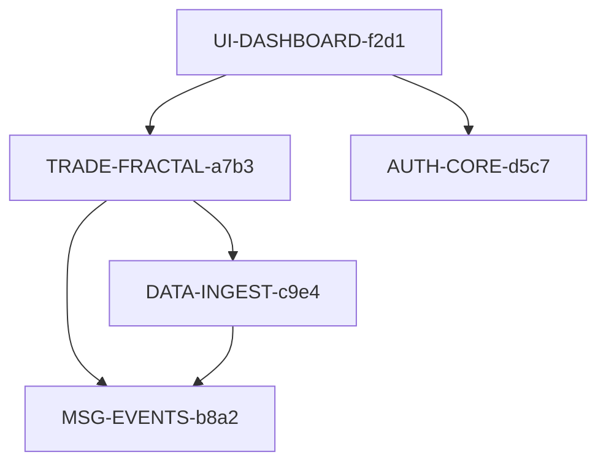

# Capability Registry

## Purpose
This registry tracks all defined capabilities in the system to help prevent naming conflicts, provide a quick reference for dependencies, and track implementation status through the complete lifecycle.

**CRITICAL**: Different document types interact with this registry at different stages. Follow the specific instructions for your current context.

## Complete Capability Lifecycle

```mermaid
graph LR
    A[1. Create Requirement.md] -->|Add to Registry| B[Registry: Not Started]
    B --> C[2. Concept ICP]
    C -->|Add New Capabilities| B2[Registry: More Entries]
    B2 --> D[3. Implementation ICP Created]
    D -->|Reference Only| E[4. Implementation ICP Executed]
    E -->|Update Status| F[Registry: In Progress]
    F -->|Complete| G[Registry: Implemented]
```



## Registry Maintenance by Document Type

### 1. When Creating Requirement Documents (domain.md/digital.md)
**ACTION: ADD new capability to registry**
```markdown
Steps for AI:
1. Generate unique ID: [DOMAIN]-[NAME]-[4-char-random]
2. Check this registry for conflicts
3. ADD new row to registry with status "Not Started"
4. Use this ID in the requirement document
```

### 2. When Creating Concept ICPs
**ACTION: ADD any newly specified capabilities**
```markdown
Steps for AI:
1. Review all capabilities being specified
2. Check which ones already exist in registry
3. ADD new rows for capabilities not yet in registry
4. Status remains "Not Started" (concepts don't implement)
```

### 3. When Creating Implementation ICPs
**ACTION: REFERENCE ONLY - Do not add**
```markdown
Steps for AI:
1. Look up capability IDs from registry
2. Reference these IDs in the ICP
3. Do NOT add new entries (should already exist)
4. Note which ICP will implement which capabilities
```

### 4. When Executing Implementation ICPs
**ACTION: UPDATE status and implementation details**
```markdown
Steps for AI:
During Implementation:
1. Update status: "Not Started" → "In Progress"
2. Add ICP reference to Notes
3. Update feature statuses in requirement docs

After Completion:
1. Update status: "In Progress" → "Implemented"
2. Update Implementation Date
3. Add final test coverage to Notes
```

## Capability Registry

| Capability ID | Capability Name | Domain | Type | Document | Status | Created Date | Implementation ICP | Completed Date | Notes |
|---------------|-----------------|--------|------|----------|--------|--------------|-------------------|----------------|-------|
| TRADE-FRACTAL-a7b3 | Fractal Analysis Engine | Trading | Service | fractal-analysis.domain.md | Not Started | 2025-08-03 | TBD | N/A | Core analysis engine |
| DATA-INGEST-c9e4 | Market Data Ingestion | Data | Service | market-data-ingest.domain.md | Not Started | 2025-08-03 | TBD | N/A | Real-time data feed |
| UI-DASHBOARD-f2d1 | Trading Dashboard | UI | Web Component | trading-dashboard.digital.md | Not Started | 2025-08-03 | TBD | N/A | Main trader interface |
| MSG-EVENTS-b8a2 | Event Bus Service | Messaging | Service | event-bus.domain.md | Not Started | 2025-08-03 | TBD | N/A | RedPanda integration |
| AUTH-CORE-d5c7 | Authentication Service | Security | Service | authentication.domain.md | Not Started | 2025-08-03 | TBD | N/A | User auth/authz |
| VIRTUAL-EXPERT-SELECTION-ve01 | Expert Selection Algorithm | Virtual Expert | Service | Virtual-Expert-Team.domain.md | Not Started | 2025-08-17 | virtual-team.implementation.icp.md | N/A | Intelligent expert routing with 95% accuracy |
| VIRTUAL-EXPERT-COORDINATION-ve02 | Primary/Secondary Agent Coordination | Virtual Expert | Service | Virtual-Expert-Team.domain.md | Not Started | 2025-08-17 | virtual-team.implementation.icp.md | N/A | Agent coordination with template orchestration |
| VIRTUAL-EXPERT-CONFLICT-ve03 | Conflict Resolution Protocol | Virtual Expert | Service | Virtual-Expert-Team.domain.md | Not Started | 2025-08-17 | virtual-team.implementation.icp.md | N/A | Expert disagreement resolution with human escalation |
| VIRTUAL-EXPERT-CLASSIFICATION-ve04 | Intelligent Workflow Classification | Virtual Expert | Service | Virtual-Expert-Team.domain.md | Not Started | 2025-08-17 | virtual-team.implementation.icp.md | N/A | Development work classification and complexity assessment |
| VIRTUAL-EXPERT-CONTEXT-ve05 | Context Engineering Integration | Virtual Expert | Integration | Virtual-Expert-Team.domain.md | Not Started | 2025-08-17 | virtual-team.implementation.icp.md | N/A | Expert guidance integration with context system |
| VIRTUAL-EXPERT-TEMPLATES-ve06 | Template System Integration | Virtual Expert | Integration | Virtual-Expert-Team.domain.md | Not Started | 2025-08-17 | virtual-team.implementation.icp.md | N/A | Template orchestration with expert coordination |
| VIRTUAL-EXPERT-PERSONAS-ve07 | Expert Persona System | Virtual Expert | Service | Virtual-Expert-Team.domain.md | Not Started | 2025-08-17 | virtual-team.implementation.icp.md | N/A | 8 specialized virtual expert personas |
| VIRTUAL-EXPERT-VALIDATION-ve08 | Post-Implementation Validation Framework | Virtual Expert | Service | Virtual-Expert-Team.domain.md | Not Started | 2025-08-17 | virtual-team.implementation.icp.md | N/A | Expert recommendation compliance verification |
| VIRTUAL-EXPERT-MONITORING-ve09 | Expert Effectiveness Monitoring | Virtual Expert | Service | Virtual-Expert-Team.domain.md | Not Started | 2025-08-17 | virtual-team.implementation.icp.md | N/A | Performance metrics and ROI tracking |
| INFRA-HTTP-TRANSPORT-ht23 | HTTP Transport Architecture for Multi-Client MCP Server | Infrastructure | Service | http-transport.domain.req.md | Implemented | 2025-08-23 | Phase 4 Step 1 | 2025-08-24 | All phases complete: Multi-client HTTP transport with Context Engineering integration |
| MCPGATEWAY-ENVREGISTRY-ae7f | Multi-Environment Registry and Service Discovery | EnvironmentMCPGateway | Service | environment-registry.domain.req.md | In Progress | 2025-09-06 | enable_environment_support.implementation.icp.md | N/A | Started 2025-09-06: Foundation multi-environment registry with 4 features |
| MCPGATEWAY-TOOLMGMT-d2e5 | Tool Management Architecture | EnvironmentMCPGateway | Service | tool-management.domain.req.md | Not Started | 2025-09-06 | enable_environment_support.implementation.icp.md | N/A | Environment-aware tool classification for 43+ tools |
| MCPGATEWAY-DIAGNOSTICS-c9d1 | Diagnostics Framework | EnvironmentMCPGateway | Service | diagnostics-framework.domain.req.md | Not Started | 2025-09-06 | enable_environment_support.implementation.icp.md | N/A | Comprehensive connectivity diagnostics and health monitoring |
| MCPGATEWAY-TRANSPORT-f4b8 | Transport Architecture Cleanup | EnvironmentMCPGateway | Service | transport-cleanup.domain.req.md | Not Started | 2025-09-06 | enable_environment_support.implementation.icp.md | N/A | HTTP transport standardization and SSE removal |

## ID Generation Guidelines

### Format: `[DOMAIN]-[NAME]-[RANDOM]`

**Domains** (use these prefixes):
- TRADE - Trading and analysis
- DATA - Data ingestion and storage
- UI - User interface components
- MSG - Messaging and events
- AUTH - Authentication/authorization
- INFRA - Infrastructure services
- REPORT - Reporting and analytics
- ALERT - Alerting and notifications

**Name** (2-3 words, hyphenated):
- Use descriptive, meaningful names
- Keep it concise
- Examples: FRACTAL-ANALYSIS, MARKET-INGEST, USER-PROFILE

**Random** (4 characters):
- Use alphanumeric (a-z, 0-9)
- Generate randomly to ensure uniqueness
- Example: a7b3, c9e4, f2d1

## Dependency Graph Overview



## Implementation Tracking

### Active ICPs
| ICP | Capabilities Affected | Status |
|-----|----------------------|--------|
| ICP-IMPL-001 | TRADE-FRACTAL-a7b3 | In Progress |

### Completed Implementations
| Date | ICP | Capability | Features Implemented |
|------|-----|------------|---------------------|
| 2025-08-24 | Phase 4 Step 1 | INFRA-HTTP-TRANSPORT-ht23 | Multi-client HTTP transport, session management, Context Engineering integration, cross-session coordination |

---

**Last Updated**: 2025-08-24
**Total Capabilities**: 15
**Implemented**: 1
**In Progress**: 0