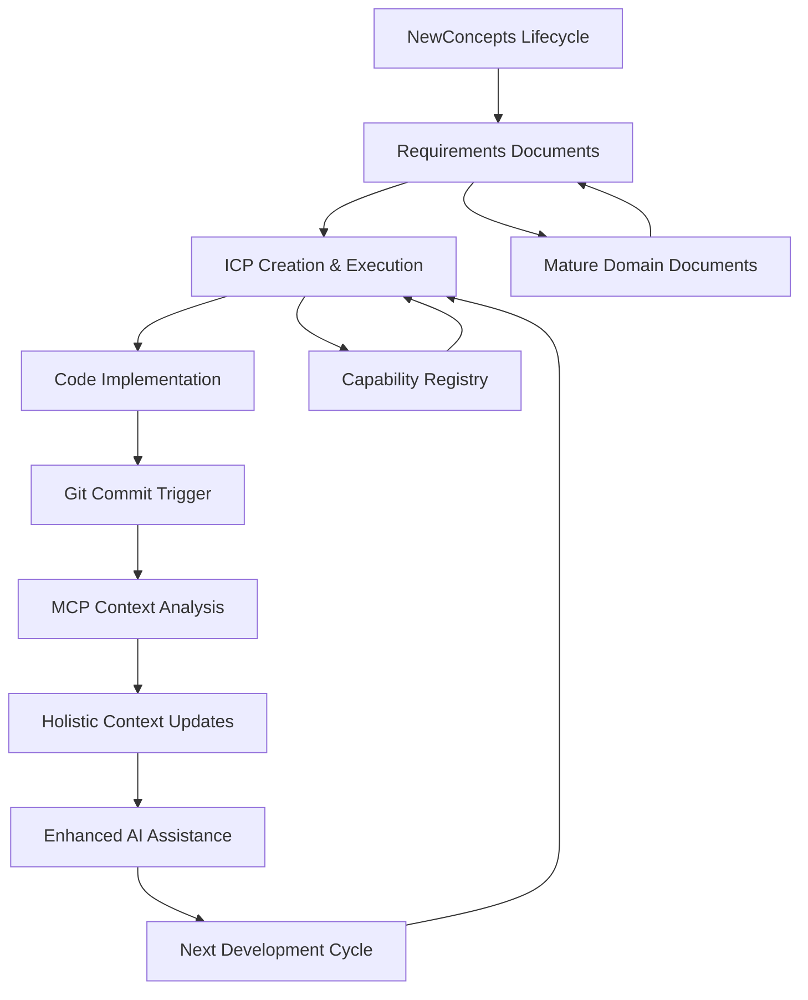

# Context Engineering System Overview

**Version**: 5.0.0
**Last Updated**: 2025-10-04
**Status**: Active

## **System Purpose**

The Context Engineering System is a comprehensive AI-powered development assistance framework that autonomously maintains accurate, semantically-rich contextual information throughout the software development lifecycle. It enables AI systems like Claude Code to provide domain-aware, business-intelligent assistance by automatically curating and updating context based on code changes, requirements evolution, and architectural decisions.

## **Three-Tier Instruction Architecture (v5.0)**

The Context Engineering System v5.0 establishes a clear instruction hierarchy to eliminate conflicts and leverage Sonnet 4.5's enhanced instruction-following capabilities:

### **Tier 1: Templates (Execution Authority)**
- **Purpose**: Imperative execution instructions
- **Content**: Complete, self-contained execution steps
- **Authority**: Highest - templates have final say on "how" to execute
- **Location**: `/Documentation/ContextEngineering/Templates/`
- **Who Uses**: AI executing ICPs

### **Tier 2: Kickstarter (Workflow Reference)**
- **Purpose**: Workflow patterns and decision trees
- **Content**: Template selection logic, process guidance
- **Authority**: Medium - provides "when" and "which" guidance
- **Location**: `/Documentation/ContextEngineering/Kickstarters/`
- **Who Uses**: AI choosing which template to use

### **Tier 3: System Overview (Conceptual Context)**
- **Purpose**: Philosophy, principles, and "why" explanations
- **Content**: Conceptual understanding, architecture, purpose
- **Authority**: Foundational - explains "why" but doesn't prescribe "how"
- **Location**: This document
- **Who Uses**: Humans and AI seeking to understand the system

### **Escalation Path**
When AI needs context beyond template instructions:
1. **First**: Check relevant template (execution details)
2. **Second**: Check kickstarter (workflow guidance)
3. **Third**: Check system overview (conceptual understanding)
4. **Last**: Ask human for clarification

## **Key Terminology**

### **Requirements (req)**
**Definition**: Complete, absolute specifications that define what must exist in the system.

Requirements documents specify the complete specifications of capabilities, business rules, and system behaviors in absolute terms rather than relative changes or deltas. They define what will be built with sufficient detail - not just "add feature X" or "modify component Y" but the full specification of what the final system should contain and how it should behave. This absolute specification approach provides AI systems with comprehensive context about what to implement, reducing ambiguity while allowing for reasonable interpretation and implementation decisions.

### **Incremental Change Prompt (ICP)**
**Definition**: Structured AI protocols that break complex work into manageable, sequential steps with validation gates.

ICPs are named "Incremental Change Prompt" because they guide AI systems through incremental, step-by-step execution of complex tasks rather than attempting everything at once. Each ICP defines a series of small, verifiable changes that build toward the complete requirements specification. This incremental approach ensures quality, enables human oversight at each step, and reduces the risk of large-scale failures. The "prompt" aspect refers to the structured instructions that guide AI execution through each incremental step.

**ICP Types**:
- **Codification ICP**: Incrementally systematize concepts into clear specifications
- **Implementation ICP**: Incrementally build working code from systematized specifications

## **DOCUMENT CREATION DECISION MATRIX**

### **When to Create Documentation**

**CREATE domain.req.md when:**
- Backend business logic with domain rules
- Infrastructure components requiring configuration  
- Service interfaces with integration patterns
- Libraries with reusable business capabilities
- **Example**: `fractal-analysis.domain.req.md`, `messaging-infrastructure.domain.req.md`

**CREATE digital.req.md when:**
- Web interfaces, dashboards, or visual components
- API endpoints with user-facing responses  
- Management consoles or admin interfaces
- Developer tools with UI components
- **Example**: `trading-dashboard.digital.req.md`, `system-admin-console.digital.req.md`

**CREATE BOTH domain.req.md AND digital.req.md when:**
- Full-stack features with both backend logic AND user interfaces
- **Example**: Trading System
  - `trading-engine.domain.req.md` (order processing, risk management, business rules)
  - `trading-interface.digital.req.md` (trader dashboard, charts, controls)

**DON'T CREATE documentation when:**
- Simple utilities with no business logic
- Generated/build artifacts  
- Third-party integrations (document patterns instead)
- Experimental/unstable code
- Pure operational scripts

### **Hybrid Organization Structure**
Documentation follows: `/Documentation/<Project>/<DDD-Concepts>/`
- **Example**: `/Documentation/Utility/Analysis/fractal-analysis.domain.req.md`
- **Rationale**: Maintains physical-logical mapping while supporting domain-driven organization

## **Core Architecture**

### **System Components**



### **Information Flow Architecture**

**Document Lifecycle:**
```
NewConcepts Exploration → Concept ICP → Implementation ICP → Code Implementation → Document Lifecycle Completion → Mature Documents
```

**Context Engineering Flow:**
```
Code Changes → Semantic Analysis → Cross-Domain Impact → Holistic Context Regeneration → AI Context Enhancement
```

**Registry Lifecycle:**
```
Placeholder IDs → Domain Discovery → Human Approval → Final Capability Registration → Status Tracking
```

## **Document Lifecycle Management**

### **Phase 1: Concept Exploration (NewConcepts)**

**Purpose**: Support exploration of concepts whose domain boundaries are unclear.

**Location**: `/Documentation/ContextEngineering/NewConcepts/`
**Templates**: `template.concept.req.md`
**Registry Strategy**: Placeholder IDs (`TEMP-[DOMAIN]-[NAME]-####`) - no registration to avoid cleanup complexity

**Key Principles:**
- Concepts start with unclear domain boundaries
- Use placeholder capability IDs to avoid registry pollution
- Focus on business value exploration over technical precision
- Expect domain boundaries to evolve during implementation

#### **Feature 4: Document Lifecycle Automation**
**Implementation Status**: ❌ Not Implemented (Implementation ICP: Phase 4 Generation)  
**Target Integration**: Document Lifecycle Management System
**Enhancement Reference**: See [Context Engineering Enhancement](/Documentation/ContextEngineering/NewConcepts/context-engineering-enhancement.domain.md) - Feature 4

**Business Description:**
Specification of automated document evolution capabilities that manage the NewConcepts → Mature Domain document lifecycle, including document migration automation, template integration, human approval workflow management, and archive/forward reference management. This reduces manual overhead while ensuring consistent document structure throughout the system.

**Technical Scope:**
- Development of document migration automation algorithms
- Integration with document template system
- Implementation of human approval workflows for document restructuring
- Development of archive and forward reference management
- Capability registry integration for placeholder → final ID conversion

**Technical Dependencies:**
- **Internal Dependencies**: 
  - Document Template System: Integration with existing template infrastructure
  - Capability Registry: Integration with registry management for ID conversion
  - NewConcepts Infrastructure: Understanding of NewConcepts folder structure and lifecycle
- **External Dependencies**: 
  - File System Operations: Document creation, migration, and archive operations
  - Human Approval Workflow: Integration with approval process for document restructuring

**Integration Requirements:**
- **Data Integration**: Document template integration and capability registry coordination
- **API Integration**: Document lifecycle management MCP tools and approval workflow APIs
- **Event Integration**: DocumentMigrationTriggered, ApprovalRequested, DocumentsRestructured events
- **UI Integration**: Human approval interface for document restructuring decisions

**Quality Requirements:**
- **Performance**: Document migration proposals generated within 5 seconds of implementation completion
- **Security**: Secure handling of document operations and approval workflow data
- **Reliability**: >99% success rate for approved document migrations with complete rollback on failure
- **Compliance**: All document restructuring requires explicit human approval before execution

**Acceptance Criteria:**
- [ ] Can propose document restructuring with >85% accuracy for human approval
- [ ] Can execute approved document migrations without data loss
- [ ] Maintains proper forward references and archive management
- [ ] Integrates seamlessly with capability registry for ID conversion
- [ ] Provides clear restructuring proposals with impact analysis

**Implementation Notes:**
User emphasized that all document restructuring requires human approval. System should propose restructuring but wait for explicit approval before executing changes. Must maintain complete audit trail of document evolution and maintain backward compatibility through forward references.

### **Phase 2: Concept Specification (Concept ICPs)**

**Purpose**: Refine concepts into detailed specifications ready for implementation.

**Process**: 
1. **Phases 1-3**: Traditional concept work (documentation, validation, finalization)
2. **Phase 4**: **MANDATORY** Implementation ICP generation

**Key Enhancement**: Concept ICPs now automatically generate Implementation ICPs as their final phase, ensuring perfect alignment between concept evolution and implementation planning.

**Registry Strategy**: 
- **Standard Concepts**: Add new capabilities to registry
- **NewConcepts**: Continue using placeholder IDs, avoid registry registration

### **Phase 3: Implementation Planning (Implementation ICPs)**

**Purpose**: Provide detailed, step-by-step implementation guidance.

**Generation**: Typically generated by Concept ICP Phase 4 to ensure alignment with refined concepts.

**Registry Strategy**:
- **Standard ICPs**: Reference existing capability IDs, update status during execution
- **NewConcepts ICPs**: Use placeholder IDs, perform domain discovery, require human approval for final capability registration

### **Phase 4: Implementation Execution**

**Purpose**: Execute implementation with autonomous context management.

**Context Integration**: AI reads relevant `.context` files for domain-aware implementation.

**Domain Discovery** (NewConcepts only): During implementation, analyze actual domain boundaries and prepare restructuring proposal for human approval.

### **Phase 5: Document Lifecycle Completion (NEW)**

**Purpose**: Systematically archive completed documents and intelligently place resulting domain/digital documents.

**ICP Integration**: Both Concept ICPs (Phase 5) and Implementation ICPs (Phase N+1) now include comprehensive completion phases.

**Concept ICP Completion Process**:
1. **Document Archival with Timestamping** (Step 5.1):
   - Automated `YYYYMMDD-HHMM` timestamp generation
   - Archives both concept.req AND codification.icp documents with timestamps
   - Updates `Implemented/README.md` with completion tracking
   - Validates archival integrity

2. **Domain Document Placement Analysis** (Step 5.2):
   - Scans project structure to determine namespace-aligned placement
   - Analyzes existing documentation for >70% conceptual overlap
   - Presents placement proposal with merge vs create recommendations
   - Human approval gate before any document changes
   - Intelligent merging with existing documents when appropriate

3. **Lifecycle Completion Validation** (Step 5.3):
   - Validates cross-references and documentation consistency
   - Generates comprehensive completion report

**Implementation ICP Completion Process**:
1. **Implementation Documentation Finalization** (Step N+1.1):
   - Updates all domain.md and digital.md files to "Implemented" status
   - Finalizes capability registry with completion dates and coverage
   - Updates cross-references across all documentation

2. **Implementation Artifact Archival** (Step N+1.2):
   - Archives implementation ICP with timestamp (for NewConcepts)
   - Updates archival index with implementation metrics
   - Validates complete implementation lifecycle integrity

### **Phase 6: Document Maturation**

**Purpose**: Convert NewConcepts to mature domain documents after implementation.

**Enhanced Process** (Building on Phase 5 completion):
1. **Domain Discovery**: Identify actual domain boundaries discovered during implementation (done in Phase 5)
2. **Human Approval**: Present restructuring proposal for approval (done in Phase 5)
3. **Document Migration**: Create mature documents using template.domain.req.md or template.digital.req.md (done in Phase 5)
4. **Archive Management**: Move original to `Implemented/` with timestamp and forward references (done in Phase 5)
5. **Registry Finalization**: Convert placeholder IDs to final capability IDs (done in Phase 5)

## **Context Engineering Architecture**

### **Autonomous Context Management**

**Trigger**: Every git commit
**Mechanism**: Git hooks integrated with EnvironmentMCPGateway MCP server
**Approach**: Holistic context regeneration (complete refresh of affected contexts)

### **Semantic Code Analysis**

**Purpose**: Understand business meaning of code changes beyond syntax
**Capabilities**:
- Business concept extraction from C# code
- Domain boundary impact analysis
- Cross-domain dependency detection
- Business rule identification

#### **Feature 1: Semantic Code Analysis Specification**
**Implementation Status**: ❌ Not Implemented (Implementation ICP: Phase 4 Generation)
**Target Integration**: MCP Integration Architecture
**Enhancement Reference**: See [Context Engineering Enhancement](/Documentation/ContextEngineering/NewConcepts/context-engineering-enhancement.domain.md) - Features 1, 2, 3

**Business Description:**
Specification of AI-powered semantic analysis capabilities that understand business meaning of code changes rather than just syntactic patterns. This enables context updates to focus on business-relevant information and business rule extraction, significantly improving AI assistance relevance and accuracy for domain-driven development.

**Technical Scope:**
- Integration with EnvironmentMCPGateway MCP server for C# AST parsing
- Business concept extraction algorithms
- Business rule identification from domain logic
- Integration with existing .context file structures for semantic enhancement

**Technical Dependencies:**
- **Internal Dependencies**: 
  - MCP Server Infrastructure: Requires EnvironmentMCPGateway enhancements for semantic analysis capabilities
  - Context File Structure: Requires existing .context file architecture for information integration
- **External Dependencies**: 
  - Claude AI API: Required for semantic analysis and business concept identification
  - C# Compiler Services: Required for AST parsing and code analysis

**Integration Requirements:**
- **Data Integration**: Semantic analysis results integrated into .context file generation pipeline
- **API Integration**: EnvironmentMCPGateway MCP tools for semantic analysis invocation
- **Event Integration**: SemanticAnalysisCompleted events for context update coordination
- **UI Integration**: N/A (backend semantic analysis capability)

**Quality Requirements:**
- **Performance**: Semantic analysis completes within 15 seconds for typical code changes to fit git hook timeframes
- **Security**: No business logic exposure in analysis metadata, secure handling of code content
- **Reliability**: >95% uptime for semantic analysis, graceful degradation to syntactic analysis on failures
- **Compliance**: Respect existing code privacy and security requirements

**Acceptance Criteria:**
- [ ] Can identify business concepts mentioned in code changes with >80% accuracy
- [ ] Can extract meaningful business rules from domain logic implementation
- [ ] Analysis completes within git hook performance parameters (<15 seconds for semantic phase)
- [ ] Integrates seamlessly with existing EnvironmentMCPGateway MCP infrastructure
- [ ] Provides semantic enhancement for all major C# language constructs

**Implementation Notes:**
Should leverage existing MCP sampling capabilities allowing AI to intelligently decide what semantic information is most contextually relevant rather than using deterministic rules. Must respect existing domain boundaries and not cross architectural concerns during analysis.

### **Holistic Context Updates**

**Principle**: Complete regeneration of affected `.context` folders to ensure consistency
**Benefits**:
- Eliminates context staleness
- Prevents information gaps from incremental updates
- Maintains cross-domain consistency
- Ensures AI systems have complete, current information

#### **Feature 2: Holistic Context Update Framework**
**Implementation Status**: ❌ Not Implemented (Implementation ICP: Phase 4 Generation)
**Target Integration**: Holistic Context Updates System
**Enhancement Reference**: See [Context Engineering Enhancement](/Documentation/ContextEngineering/NewConcepts/context-engineering-enhancement.domain.md) - Features 1, 4

**Business Description:**
Specification of complete context regeneration framework that ensures consistency and prevents information gaps through atomic updates of all affected .context folders. This eliminates context staleness issues and ensures AI systems always have current, complete information about the codebase state across all domain boundaries.

**Technical Scope:**
- Development of holistic context regeneration algorithms
- Atomic context update mechanisms across multiple domains
- Domain boundary detection for affected context identification
- Performance optimization for large-scale context regeneration within git hook constraints

**Technical Dependencies:**
- **Internal Dependencies**: 
  - Feature 1: Semantic analysis capabilities for meaningful context content generation
  - Domain Impact Analysis: Capability to identify all affected domains from code changes
- **External Dependencies**: 
  - File System Operations: Atomic file operations across multiple .context folders
  - Git Hook Infrastructure: Integration with existing git pre-commit hook timing requirements

**Integration Requirements:**
- **Data Integration**: Coordinate updates across multiple .context folders while maintaining consistency
- **API Integration**: MCP tools for holistic update orchestration and coordination
- **Event Integration**: ContextRegenerationTriggered, ContextUpdateCompleted, CrossDomainContextUpdated events
- **UI Integration**: N/A (backend context management capability)

**Quality Requirements:**
- **Performance**: Complete holistic updates within git hook timeframes (<30 seconds total, <15 seconds for holistic update phase)
- **Security**: Secure handling of context file operations, proper file permissions and access control
- **Reliability**: >99.5% success rate for holistic updates, complete rollback on any failure
- **Compliance**: Respect existing file system permissions and backup requirements

**Acceptance Criteria:**
- [ ] Can identify all affected domains from code changes with >95% accuracy
- [ ] Can regenerate all affected .context files within git hook performance requirements
- [ ] Maintains consistency across all related .context files during updates
- [ ] Provides atomic updates with complete rollback on any failure
- [ ] Handles concurrent context update conflicts gracefully

**Implementation Notes:**
User specifically requested holistic updates to avoid missing information. System must completely regenerate affected .context folders rather than attempting incremental updates. Must coordinate with cross-domain impact analysis to ensure all related contexts are updated together.

### **Cross-Domain Impact Analysis**

**Purpose**: Detect when changes in one domain affect context in other domains
**Mechanism**: 
- Analyze domain integration patterns
- Map cross-domain dependencies
- Coordinate multi-domain context updates
- Respect DDD domain boundaries

#### **Feature 3: Cross-Domain Impact Analysis**
**Implementation Status**: ✅ **COMPLETED** - Fully implemented and tested
**Target Integration**: Cross-Domain Impact Analysis System

**Business Description:**
Specification of intelligent analysis capabilities that understand how changes in one domain affect context requirements in other domains within the DDD architecture. This prevents context inconsistencies and ensures AI systems have complete information about system-wide impacts while respecting domain boundaries.

**Technical Scope:**
- Development of cross-domain dependency analysis algorithms
- Domain impact mapping based on existing integration patterns
- Coordinated multi-domain context update orchestration
- Integration with existing DDD domain boundary definitions

**Technical Dependencies:**
- **Internal Dependencies**: 
  - Feature 1: Semantic analysis for understanding business impact of changes
  - Feature 2: Holistic update framework for coordinated multi-domain updates
  - Domain Boundary Knowledge: Understanding of existing DDD domain definitions
- **External Dependencies**: 
  - DDD Architecture: Existing domain boundary definitions and integration patterns
  - Event Bus Integration: Understanding of existing domain event patterns

**Integration Requirements:**
- **Data Integration**: Analysis of existing domain integration patterns and dependency mappings
- **API Integration**: Cross-domain impact analysis MCP tools and domain coordination APIs
- **Event Integration**: CrossDomainImpactDetected, MultiDomainUpdateTriggered events
- **UI Integration**: N/A (backend analysis capability)

**Quality Requirements:**
- **Performance**: Cross-domain analysis completes within 10 seconds to fit overall git hook timing
- **Security**: Respect domain boundary privacy and don't expose internal domain details inappropriately
- **Reliability**: >90% accuracy with minimal false negatives for cross-domain impact detection
- **Compliance**: Full compliance with existing DDD architectural principles and domain autonomy

**Acceptance Criteria:**
- [ ] Can detect cross-domain impacts with >90% accuracy (minimal false negatives)
- [ ] Can coordinate updates across multiple domains without conflicts
- [ ] Respects existing DDD domain boundaries and integration patterns
- [ ] Handles complex multi-domain scenarios (3+ domains affected)
- [ ] Provides clear impact analysis for human review when uncertainty exists

**Implementation Notes:**
Critical for maintaining context consistency in DDD architecture. User emphasized that all affected domains must be updated to prevent system inconsistencies. Must understand and respect existing domain boundaries rather than creating new coupling between domains.

### **MCP Integration Architecture**

**Core MCP Tools**:
```typescript
// Semantic analysis and context generation
- analyze-code-changes-for-context
- generate-domain-context-holistic
- analyze-cross-domain-impact
- execute-full-repository-reindex ✅ IMPLEMENTED

// Document lifecycle management
- migrate-newconcept-to-domains
- validate-document-restructuring
- archive-implemented-concepts

// Registry management
- convert-placeholder-capabilities
- update-capability-registry
- validate-registry-consistency
```

### **Full Repository Re-indexing**

**Purpose**: Complete regeneration of all `.context` files across the entire repository with optional cleanup of existing context files.

**MCP Tool**: `execute-full-repository-reindex`

**Key Features**:
- **Automatic Discovery**: Dynamically discovers all source files (`.cs`, `.ts`, `.js`, `.py`) while excluding build artifacts (`node_modules`, `bin`, `obj`, `.git`, `TestResults`)
- **Context Cleanup**: Optional removal of existing `.context` directories before re-indexing to ensure clean state
- **Batch Processing**: Processes files in batches of 50 to avoid system overload during large repository operations
- **Performance Monitoring**: Tracks files discovered, analyzed, context files removed/generated, and execution time
- **Error Handling**: Comprehensive error handling with detailed failure reporting and metrics
- **Trigger Support**: Supports multiple trigger types (`git-hook`, `manual`, `scheduled`) for different operational scenarios

**Configuration Options**:
- `cleanupFirst`: Remove existing `.context` directories before re-indexing (default: true)
- `batchSize`: Number of files to process per batch (default: 50)
- `performanceTimeout`: Maximum execution time in seconds (default: 300, max: 1800)
- `triggerType`: Source of the re-indexing trigger for audit purposes

**Use Cases**:
- **Initial Setup**: Bootstrap `.context` files for existing codebases
- **Major Refactoring**: Regenerate all context after significant architectural changes
- **Recovery Operations**: Restore context files after corruption or accidental deletion
- **Maintenance**: Periodic full refresh to ensure context accuracy across all domains

**Performance Characteristics**:
- Designed to process 200+ source files within git hook timeframes
- Batch processing prevents memory overflow on large repositories
- Progress reporting every 10 files processed during execution
- Comprehensive metrics collection for performance monitoring

**Integration with Holistic Updates**:
- Leverages existing holistic context update infrastructure
- Maintains consistency with incremental context update mechanisms
- Coordinates with cross-domain impact analysis for complete coverage
- Supports atomic operations with rollback capability

## **Context File Architecture**

### **Mirrored Namespace Structure**

Context files mirror the code namespace structure to maintain clear domain alignment:

```
/Utility/Analysis/                          (Code)
/Documentation/Utility/Analysis/            (Requirements & Documentation)
/Utility/Analysis/.context/                 (AI Context Files)
```

### **Context File Generation Strategy**

**Standard Domains**: Context generated from:
- Existing mature requirement documents
- Current code implementation
- Cross-domain integration patterns
- Recent change analysis

**NewConcepts**: Context generated from:
- Exploratory requirement documents loaded into prompt context
- No permanent `.context` files during exploration phase
- Context files created only after maturation to proper domains

### **Context Content Strategy**

**Domain-Specific Context Files**:
- `domain-overview.md` - Generated from requirements + code analysis
- `current-implementation.md` - Generated from actual code state
- `business-rules.md` - Extracted from requirement documents
- `integration-points.md` - Cross-domain interfaces and dependencies
- `recent-changes.md` - What changed in the triggering commit

## **Capability Registry Integration**

### **Registry Lifecycle Management**

**Standard Capabilities**:
1. **Creation**: Added during Concept ICP execution
2. **Implementation**: Status updated during Implementation ICP execution
3. **Completion**: Final status and details recorded

**NewConcepts Capabilities**:
1. **Exploration**: Placeholder IDs used, no registry entries
2. **Implementation**: Domain discovery during Implementation ICP execution
3. **Human Approval**: Restructuring proposal generated for human approval
4. **Finalization**: Final capability IDs registered after approval

#### **Feature 5: Registry Lifecycle Management**
**Implementation Status**: ❌ Not Implemented (Implementation ICP: Phase 4 Generation)
**Target Integration**: Capability Registry Integration System
**Enhancement Reference**: See [Context Engineering Enhancement](/Documentation/ContextEngineering/NewConcepts/context-engineering-enhancement.domain.md) - Feature 5

**Business Description:**
Specification of intelligent capability registry management that handles placeholder capability ID lifecycle, registry consistency validation, and automated registry updates throughout the complete concept → implementation lifecycle. This maintains registry integrity while supporting agile concept development through the NewConcepts approach.

**Technical Scope:**
- Development of placeholder → final capability ID conversion algorithms
- Registry consistency validation and audit capabilities
- Automated registry updates during ICP execution
- Integration with document lifecycle management for coordinated registry updates

**Technical Dependencies:**
- **Internal Dependencies**: 
  - Feature 4: Document lifecycle automation for coordinated registry updates
  - Capability Registry: Existing capability registry structure and validation patterns
  - ICP Execution System: Integration with ICP execution workflow for status updates
- **External Dependencies**: 
  - Registry Storage: Integration with capability registry storage and version control
  - Human Approval System: Integration with approval workflow for registry changes

**Integration Requirements:**
- **Data Integration**: Capability registry consistency maintenance and placeholder ID tracking
- **API Integration**: Registry management MCP tools and consistency validation APIs
- **Event Integration**: PlaceholderIDConverted, RegistryConsistencyValidated events
- **UI Integration**: Registry status reporting and human approval interfaces for registry changes

**Quality Requirements:**
- **Performance**: Registry consistency validation completes within 5 seconds
- **Security**: Secure handling of capability registry data and change audit trails
- **Reliability**: >99.9% registry consistency maintenance with complete audit trail
- **Compliance**: All registry modifications follow established governance and approval processes

**Acceptance Criteria:**
- [ ] Manages placeholder capability ID lifecycle without registry pollution
- [ ] Maintains registry consistency throughout all concept → implementation transitions
- [ ] Provides complete audit trail of capability evolution from concept to implementation
- [ ] Integrates seamlessly with ICP execution for automated status updates
- [ ] Validates registry consistency and provides clear error reporting

**Implementation Notes:**
Critical for maintaining capability registry integrity while supporting the NewConcepts lifecycle. Must ensure that placeholder IDs never pollute the main registry while providing seamless transition to final registered capabilities.

### **Placeholder ID Management**

**Format**: `TEMP-[DOMAIN]-[NAME]-[4-random-chars]`
**Purpose**: Avoid registry pollution during concept exploration
**Lifecycle**: Placeholder → Domain Discovery → Human Approval → Final Registration

### **Registry Consistency**

**Validation**: Automatic validation of registry consistency during context updates
**Cleanup**: No cleanup required for placeholder IDs (they're never registered)
**Audit Trail**: Complete history of capability evolution from concept to implementation

## **Human Approval Gates**

### **Document Restructuring Approval**

**Trigger**: NewConcepts Implementation ICP completion
**Required Information**:
- Original concept document path
- Discovered domain boundaries
- Proposed mature document locations
- Placeholder → Final capability ID mapping
- Integration points and dependencies

**Approval Process**:
1. AI generates restructuring proposal
2. Human reviews and approves/modifies proposal
3. AI executes approved restructuring
4. Final validation and archive management

### **Quality Assurance Gates**

**Context Update Validation**: Automatic validation of context consistency across domains
**Integration Validation**: Verification that cross-domain updates maintain architectural integrity
**Performance Validation**: Ensure context updates complete within acceptable timeframes

## **Technical Integration Points**

### **Git Hook Integration**

**Current State**: Basic pattern matching with manual notifications
**Enhanced State**: Full MCP integration with semantic analysis and autonomous updates

**Integration Flow**:
1. Git commit triggers pre-commit hook
2. Hook calls EnvironmentMCPGateway MCP tools
3. MCP performs semantic analysis of changes
4. Holistic context regeneration executed
5. Cross-domain impact analysis and updates
6. Registry updates if needed
7. **Full repository re-indexing** available for comprehensive updates

### **EnvironmentMCPGateway Enhancement**

**New Capabilities Required**:
- Semantic C# code analysis
- Business concept extraction
- Cross-domain impact analysis
- Document lifecycle management
- Registry management integration
- Context Engineering Compliance monitoring and enforcement

**Implemented Capabilities**:
- ✅ **Full Repository Re-indexing**: Complete context regeneration with cleanup functionality

### **Context Engineering Compliance Agent**

**Purpose**: Ensure all Context Engineering protocols, ICP template instructions, and development process requirements are properly followed during AI execution.

**Core Functionality**:
- **Protocol Compliance Monitoring**: Validates that AI execution follows established ICP protocols and template instruction sequences
- **Mandatory Step Enforcement**: Prevents skipping of required human approval gates, validation checkpoints, and process compliance steps
- **Instruction Execution Validation**: Ensures sophisticated instructions embedded in templates and ICP documents are executed completely rather than abbreviated
- **Audit Trail Maintenance**: Maintains comprehensive logs of all protocol compliance validation and enforcement actions
- **Process Integrity Verification**: Monitors overall Context Engineering system integrity and detects process violations

**Integration Points**:
- **Template System**: Monitors ICP execution for template instruction compliance and mandatory stop protocol adherence
- **Human Approval Workflows**: Coordinates with approval gate enforcement ensuring AI cannot bypass required human review
- **Context Engineering Operations**: Validates proper execution of holistic context updates, cross-domain analysis, and document lifecycle management
- **Virtual Expert System**: Ensures expert consultation protocols are followed and expert validation requirements are met

**Critical Problem Addressed**: The Context Engineering Compliance Agent specifically addresses the issue where detailed instructions embedded in templates and ICP documents are frequently skipped during AI execution, leading to incomplete implementations that violate established development processes. This agent operates as a meta-level monitoring system that ensures process integrity and protocol compliance throughout all Context Engineering activities.

### **Enhanced Template System Integration**

**Template Usage Strategy**:
- NewConcepts use template.concept.req.md during exploration
- Mature documents use template.domain.req.md and template.digital.req.md with full DDD guidance
- Template evolution tracked through concept → mature document migration

**Template Versioning System** (NEW):
- **Consistent Versioning**: All templates now include comprehensive update instructions
- **Version Tracking**: Major/Minor/Patch increment rules enforced across all templates
- **Change Documentation**: Template descriptions reflect actual changes made
- **Template Updates**: AI must follow 5-point versioning instruction system

**Enhanced ICP Templates**:
- **Concept ICPs**: `template.codification.icp.md` v3.0.0 - Added Phase 5 Document Lifecycle Completion
- **Implementation ICPs**: `template.implementation.icp.md` v2.0.0 - Added Phase N+1 Implementation Lifecycle Completion
- **Setup ICPs**: `template.setup.icp.md` v1.0.0 - Added versioning system

**Completion Workflow Integration**:
- **Automated Archival**: Both ICP types now include systematic document archival with timestamping
- **Intelligent Placement**: Analysis of project structure for namespace-aligned document placement
- **Merge Intelligence**: Existing documents enhanced rather than duplicated when conceptually similar
- **Human Approval Gates**: Required approval for document placement and merge strategies

## **Performance and Scalability**

### **Performance Requirements**

**Git Hook Performance**: Context updates must complete within acceptable commit timeframes (<30 seconds)
**Scalability**: System must scale with codebase size and team size
**Reliability**: Autonomous operation with minimal human intervention required

### **Performance Optimization Strategies**

**Incremental Analysis**: Analyze only changed files and their direct dependencies
**Caching Strategy**: Cache semantic analysis results for unchanged code
**Background Processing**: Option for background context updates for large changes
**Performance Monitoring**: Track context update performance and optimize bottlenecks

## **Success Measurement**

### **Primary Success Metrics**

**AI Assistance Quality**: Measured through:
- ICP implementation success rates
- Code revision cycle reduction
- Developer productivity improvements
- Time-to-implementation for new features

**Context Maintenance Efficiency**: Measured through:
- Reduction in manual context updates
- Context accuracy and relevance
- Cross-domain consistency maintenance
- Registry management automation

**Process Adoption**: Measured through:
- NewConcepts lifecycle usage
- Developer satisfaction with enhanced AI assistance
- Reduction in requirements refinement cycles
- Architecture consistency maintenance

### **Quality Indicators**

**Context Accuracy**: Context files accurately reflect current system state and business rules
**Cross-Domain Consistency**: Changes properly propagate across all affected domains
**Registry Integrity**: Capability registry maintains consistency throughout all lifecycle phases
**Document Evolution**: Smooth transition from NewConcepts to mature domain documents

## **Risk Management**

### **Technical Risks and Mitigations**

**Semantic Analysis Quality**: 
- Risk: AI analysis may miss important business concepts
- Mitigation: Human review mechanisms, gradual automation increase, feedback loops

**Performance Impact**: 
- Risk: Context updates may slow commit process
- Mitigation: Performance optimization, background processing options, caching strategies

**Cross-Domain Complexity**: 
- Risk: Complex domain interactions may cause incorrect updates
- Mitigation: Clear interface definitions, extensive integration testing, rollback capabilities

### **Process Risks and Mitigations**

**Team Adoption**: 
- Risk: Complex new process may impede adoption
- Mitigation: Comprehensive documentation, gradual rollout, training and support

**Document Migration Complexity**: 
- Risk: NewConcepts → Mature document migration may introduce errors
- Mitigation: Human approval gates, validation mechanisms, rollback procedures

**Registry Management**: 
- Risk: Capability registry may become inconsistent
- Mitigation: Automatic validation, audit trails, consistency checking

## **Future Evolution**

### **Planned Enhancements**

**AI Analysis Sophistication**: Enhanced semantic analysis capabilities, better business rule extraction
**Cross-Project Context**: Context sharing across related projects and repositories
**Predictive Context**: AI-driven prediction of context needs based on development patterns
**Team Collaboration**: Context sharing and collaboration features for distributed teams

### **Integration Opportunities**

**External Systems**: Integration with external documentation, design systems, and knowledge bases
**Development Tools**: Integration with IDEs, code review systems, and project management tools
**Monitoring and Analytics**: Advanced analytics on context usage and effectiveness
**Enterprise Knowledge**: Integration with enterprise architecture and knowledge management systems

## **Implementation Phases**

### **Phase 1: Foundation** (Current)
- NewConcepts lifecycle infrastructure
- Template system enhancements
- Documentation and process definition
- Technical specifications for all 5 core features (completed via Codification ICP)

### **Phase 2: MCP Integration** (Partially Complete)
- ✅ **Full Repository Re-indexing**: Complete implementation with cleanup capabilities
- EnvironmentMCPGateway enhancements for granular context creation
- Feature 1: Semantic code analysis capabilities implementation (Enhanced specifications ready - see [Context Engineering Enhancement](/Documentation/ContextEngineering/NewConcepts/context-engineering-enhancement.domain.md))
- Git hook integration with MCP
- Performance validation and optimization

### **Phase 3: Autonomous Context Management** (Implementation ICP - To Be Generated)
- Feature 2: Holistic context update implementation
- Feature 3: Cross-domain impact analysis implementation
- Atomic update mechanisms and rollback procedures
- Performance optimization for large-scale updates

### **Phase 4: Lifecycle Management** (Implementation ICP - To Be Generated)
- Feature 4: Document lifecycle automation implementation
- Feature 5: Registry lifecycle management implementation
- Human approval workflow integration
- Archive and forward reference management

### **Phase 5: Advanced Features** (Future)
- Predictive context management
- Advanced analytics and monitoring
- Enterprise integration capabilities
- Cross-project context sharing

---

**Document Metadata**
- **System**: Context Engineering
- **Version**: 5.0.0
- **Created**: 2025-08-04
- **Last Updated**: 2025-10-04
- **Status**: Active
- **Next Review**: After v5.0 adoption and dog-fooding validation
- **v5.0.0 Notes**: Major upgrade for Sonnet 4.5 optimization - Three-tier instruction architecture, bunker stop gates, state persistence, 3x3 execution blocks, self-validation, tool restrictions, context rollover protocol, decentralized capability tracking, template instruction separation, version alignment

**Related Documentation**
- [Concept Requirements Template](../Templates/template.concept.req.md)
- [Codification ICP Template](../Templates/template.codification.icp.md)
- [Implementation ICP Template](../Templates/template.implementation.icp.md)
- [Context Engineering Requirements](../NewConcepts/context-engineering.domain.req.md)
- [Context Engineering Codification ICP](../NewConcepts/context-engineering.codification.icp.md)
- [Context Engineering Enhancement Specifications](../NewConcepts/context-engineering-enhancement.domain.md)

This comprehensive system provides autonomous, intelligent context management that evolves with your codebase and team needs while maintaining architectural integrity and supporting agile concept development.