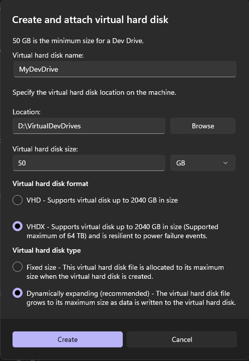

# Lucidwonks Algo Platform Development Setup Guide

*Owned by Alex Pecoraro*  
*Last updated: Feb 23, 2025*  
*5 min read*

## Platform Overview

Lucidwonks' Algo Platform has several different components, including:

- C# Blazor application that is both Server and Client side
- Console command line application called Lucid
- TimeScaleDB - Based on PostgreSQL running in a docker container on Ubuntu
- *<more to come>*

## Environment Setup Instructions

### 1. Windows Update
Run Windows update; the Environment should be Windows 10 or 11.

### 2. Docker Preparation
From Windows, create a folder in OneDrive called `Projects/DockerVolumes`.

**Full path example:** `C:\Users\[YourUsername]\OneDrive\Projects\DockerVolumes`

> **💡 Important:** This folder will be used to store Docker volume data that persists between container restarts. Make sure OneDrive is properly synced.

### 3. Install Docker Desktop
Download and install Docker Desktop from the official website.

### 4. Enable Windows Subsystem for Linux
Before installing Ubuntu, go to **Control Panel > Programs > Turn Windows Features On Or Off**. Enable the "Windows Subsystem for Linux" option in the list, and then click the "OK" button. Restart if you have to change the settings.

When you install Ubuntu on your machine, you're running a Linux environment on your Windows machine and when you launch Ubuntu, it will load its BASH console (it looks like a command line utility). The commands you run there use Linux commands and are case-sensitive.

### 5. Install Ubuntu
Install "Ubuntu" from the Windows Store (version: Ubuntu 22.04.3 LTS) – this is the version I used, but the latest should be fine too.

**Installation Steps:**
1. Open Microsoft Store
2. Search for "Ubuntu"
3. Install "Ubuntu 22.04.3 LTS" (or latest available)
4. Launch Ubuntu from Start menu
5. Wait for initial setup to complete
6. Create your user account when prompted

**Required Credentials:**
- **Username:** `lucid`
- **Password:** `wonk`

> **⚠️ Security Note:** These are development credentials. Consider using stronger passwords for production environments.

### 6. Configure WSL
After installing Ubuntu, you need to make sure that the Ubuntu version is set to run v2 and that Ubuntu is the default (after you've installed Docker you'll note that there are multiple Linux types). The following three commands will make sure it is configured properly and should be run from within **Windows PowerShell as Administrator** (Note that you DO NOT want to run these commands from the Ubuntu BASH prompt as we are configuring Windows):

#### 6a. Check WSL Version
First, check which distributions are installed and their versions:wsl.exe -l -vThis will show you something like:  NAME      STATE           VERSION
* Ubuntu    Running         2
#### 6b. Set Ubuntu to WSL2 (if needed)
If Ubuntu is not already running as version 2, run:wsl.exe --set-version ubuntu 2*(This second command is only needed if Ubuntu is not already running as v2)*

#### 6c. Set Ubuntu as Default
Make Ubuntu the default WSL distribution:wsl.exe --set-default ubuntu
**Expected Result Screenshot:** 
*This screenshot shows the WSL configuration with Ubuntu running as v2 and set as default*

> **Note:** WSL is the command-line tool for the Windows Subsystem for Linux. This tool allows users to run a Linux distribution directly on the Windows operating system without a virtual machine.

### 7. Install TimeScaleDB

Next up is the timescale database. The official documentation is here: [TigerData Documentation | Install TimescaleDB on Docker](https://docs.timescale.com/install/latest/installation-docker/) but following the below steps is the quickest.

TimeScaleDB is based on PostgreSQL database with custom extensions to handle time-series data, like stock OHLCV data. The following instructions will install a docker container instance of the database.

#### 7a. Create Project Folder
From Windows, create the following project folder(s), where `<USER>` is your Windows user name:
c:/Users/<USER>/OneDrive/Projects/DockerVolumes
#### 7b. Launch Ubuntu and Navigate
Launch Ubuntu. From within the Ubuntu BASH, change the Directory to the directory you created in step 7a:
cd /mnt/c/Users/<USER>/OneDrive/Projects/DockerVolumes
#### 7c. Pull TimeScaleDB Image
Pull the container TimeScaleDB image:
docker pull timescale/timescaledb-ha:pg16
#### 7d. Create Docker Volume
Launch Docker, select "Volumes" from the left-hand navigation. Select the "Create" button on the top right and create a new volume called "timescaledb_data".

#### 7e. Run TimeScaleDB Container
From the Ubuntu BASH prompt type the following command to spin up the container using the newly created volume:
docker run -d --name timescaledb -p 5432:5432 -v timescaledb_data:/home/postgres/pgdata/data -e POSTGRES_PASSWORD=password timescale/timescaledb-ha:pg16
#### 7f. Container Management
After the container has been spun up the first time via the command in 7e, thereafter you can control the container instance from within Docker by selecting "Containers" from the left-hand nav. The timescaledb container can be started and stopped via the control on the right-hand side.

**Docker Desktop Screenshot:** 
*This screenshot shows the Docker Desktop interface with the installed timescaledb container*

#### 7g. Verify Container is Running
You can verify the container is running properly by checking:
1. In Docker Desktop, the container should show a green "Running" status
2. You can also check from command line:docker ps   This should show the timescaledb container in the list of running containers.

### 8. Install PGAdmin (Optional)
Install the PGAdmin GUI PostgreSQL management tool: [pgAdmin - PostgreSQL Tools](https://www.pgadmin.org/). This is a db management tool for Postgres and is helpful for running queries against the database.

Create a new connection to the TimeScaleDB:
- **Host:** localhost
- **Port:** 5432
- **Username:** postgres
- **Password:** password

### 9. Install Visual Studio 2024
Install Visual Studio 2024 with the following options:

- ASP.NET Core and web development
- Azure development
- Python development
- Node.js development
- .NET Multi-platform App UI development
- .NET desktop development
- Universal Windows Platform development
- Data storage and processing
- Data science and analytical applications

### 10. Create a Developer Drive
This is a virtual drive made specifically for development. It's a little bit of a hassle, but I found it much more reliable as the Development Drives are ignored by virus scanning software, which significantly improves build performance.

#### 10a. Windows 11 Setup
To set up a new Dev Drive, open Windows Settings and navigate to **System > Storage > Advanced Storage Settings > Disks & volumes**. Select **Create dev drive**. Follow the prompts...

**Dev Drive Creation Screenshots:**
- Initial setup: 

- Configuration dialog: 

- Size and location settings: 

- Final confirmation: 

> **Note:** I made my DevDrive "M" but I couldn't take a screen shot of it as that letter was already used.

**Recommended Settings:**
- **Size:** At least 50GB (100GB+ recommended for full development)
- **Location:** Store the .vhdx file on your fastest drive (typically C: drive SSD)
- **Drive Letter:** Choose an available letter (M: is a good choice)
- **Label:** "DevDrive" or "Development"

#### 10b. Create Task Scheduler Entry
Create a Task Scheduler entry so that the Dev drive automatically connects when you reboot. This is crucial because Dev Drives don't auto-mount like regular drives.

1. Start "Task Scheduler" (search for it in Start menu)
2. Click "Create Task" button on the right-side panel

**Task Scheduler Configuration Screenshots:**
- Main Task Scheduler window: 

- General tab settings: 

- Triggers tab: 

- Actions tab: 
 

- New Action dialog: 

- PowerShell arguments: 

- Security options: 
 

**Detailed Task Configuration:**

**General Tab:**
- **Name:** "Mount Dev Drive"
- **Description:** "Automatically mount development drive on startup"
- **Security options:** "Run whether user is logged on or not"
- **Run with highest privileges:** ✓ (checked)

**Triggers Tab:**
- **Begin the task:** "At startup"
- **Delay task for:** 30 seconds (to ensure system is ready)

**Actions Tab:**
- **Action:** "Start a program"
- **Program/script:** `powershell.exe`
- **Add arguments:** Mount-DiskImage -ImagePath "D:\VirtualDevDrives\MyDevDrive.vhdx"  *(Replace the path with your actual .vhdx file location)*

**Conditions Tab:**
- Uncheck "Start the task only if the computer is on AC power"

**Settings Tab:**
- **Allow task to be run on demand:** ✓ (checked)
- **If the task fails, restart every:** 1 minute
- **Attempt to restart up to:** 3 times

3. Press **OK** and enter your Windows password when prompted
4. You should now have your Development Drive automatically remount when you reboot

**Testing the Setup:**
- You can test the task by right-clicking it in Task Scheduler and selecting "Run"
- The Dev Drive should appear in File Explorer within a few seconds

### 11. Install Git for Windows
Install Git for Windows (use the default install settings):  
[https://git-scm.com/download/win](https://git-scm.com/download/win)

### 12. Enable Git Large File Storage
Enable Git Large File Storage ([Git Large File Storage](https://git-lfs.github.io/)).

1. Open a CMD window (Start → RUN "cmd")
2. Execute the following command:
git lfs install
### 13. Clone the Repository
Open Visual Studio 2024 and "Clone a repository":

**Repository Details:**
- **Repository URL:** `https://github.com/LucidWonk/LucidRepo.git`
- **Local Path:** Use the new Dev drive for the path. Recommended location: `M:\Projects\Lucidwonks`

**Clone Repository Screenshot:** 

*This screenshot shows the Visual Studio Clone a repository dialog with the correct settings*

**Step-by-step process:**
1. Open Visual Studio 2024
2. On the start screen, click "Clone a repository"
3. Enter the repository URL: `https://github.com/LucidWonk/LucidRepo.git`
4. Browse to your Dev Drive and create the path: `M:\Projects\Lucidwonks`
5. Click "Clone"
6. Visual Studio will download the repository and open it automatically

**Important Notes:**
- Make sure you're cloning to your Dev Drive (M: or whatever letter you chose)
- The clone process may take several minutes due to Git LFS files
- You may be prompted for GitHub credentials if the repository is private

### 14. Build and Initialize

#### 14a. Verify Prerequisites
Before building, ensure all components are properly set up:

1. **Docker Desktop** is running
2. **TimeScaleDB container** is running (check in Docker Desktop)
3. **Dev Drive** is mounted and accessible
4. **Repository** is cloned to your Dev Drive

#### 14b. Build the Solution
1. In Visual Studio, open the solution file
2. Right-click on the solution in Solution Explorer
3. Select "Restore NuGet Packages" (if not done automatically)
4. Build the solution (Ctrl+Shift+B or Build → Build Solution)

#### 14c. Database Initialization
1. Make sure the TimeScaleDB container is running in Docker
2. Use the console application (Lucid) to load initial data:# Navigate to the console app directory
cd M:\Projects\Lucidwonks\[ConsoleAppFolder]

# Run the data initialization script
dotnet run -- init-database   *(Adjust the exact command based on your console app's implementation)*

#### 14d. Verify Setup
1. **Database Connection:** Test that the Blazor app can connect to TimeScaleDB
2. **Console App:** Verify the Lucid console application runs without errors
3. **Blazor App:** Launch the Blazor application and verify it loads correctly

**Common Issues:**
- If database connection fails, check that the TimeScaleDB container is running on port 5432
- If NuGet restore fails, try clearing the NuGet cache
- If builds are slow, verify you're building on the Dev Drive (virus scanner exclusion)

## Summary
Your development environment should now be ready for the Lucidwonks Algo Platform development. The setup includes:

✅ **Development Environment:** Windows 10/11 with Visual Studio 2024  
✅ **Containerization:** Docker Desktop with TimeScaleDB  
✅ **Linux Subsystem:** WSL2 with Ubuntu 22.04  
✅ **Performance Optimization:** Dev Drive for faster builds  
✅ **Source Control:** Git with LFS support  
✅ **Database:** TimeScaleDB ready for time-series data  

**Next Steps:**
1. Familiarize yourself with the codebase structure
2. Review the existing Domain-Driven Design patterns
3. Test the algorithmic trading components
4. Set up your development workflow

## Troubleshooting

### Common Issues and Solutions

**Issue:** WSL2 not working properly
- **Solution:** Ensure virtualization is enabled in BIOS and Windows Hypervisor Platform is enabled

**Issue:** Docker containers won't start
- **Solution:** Restart Docker Desktop, check WSL2 integration settings

**Issue:** TimeScaleDB connection refused
- **Solution:** Verify container is running, check port 5432 isn't blocked by firewall

**Issue:** Dev Drive not mounting automatically
- **Solution:** Check Task Scheduler entry, verify .vhdx file path is correct

**Issue:** Git LFS files not downloading
- **Solution:** Run `git lfs pull` in the repository directory

**Issue:** Slow build times
- **Solution:** Verify project is on Dev Drive, check antivirus exclusions